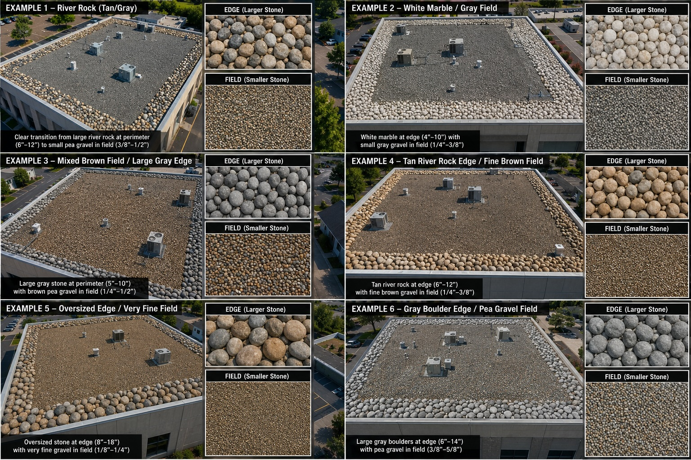
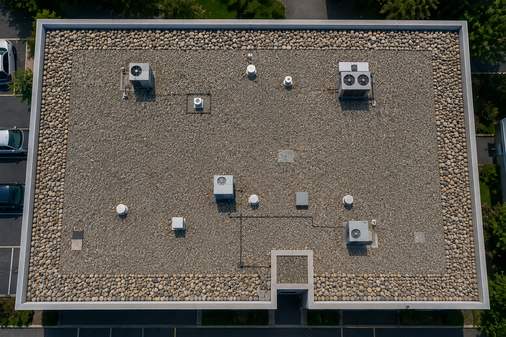
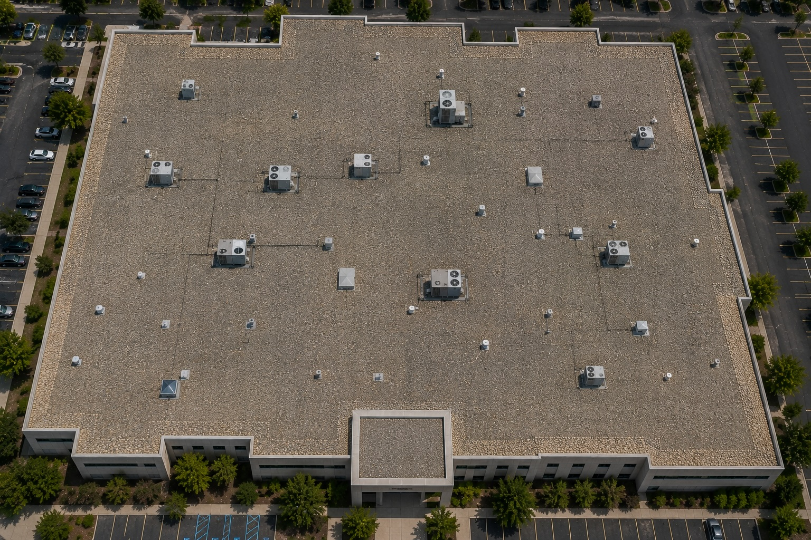
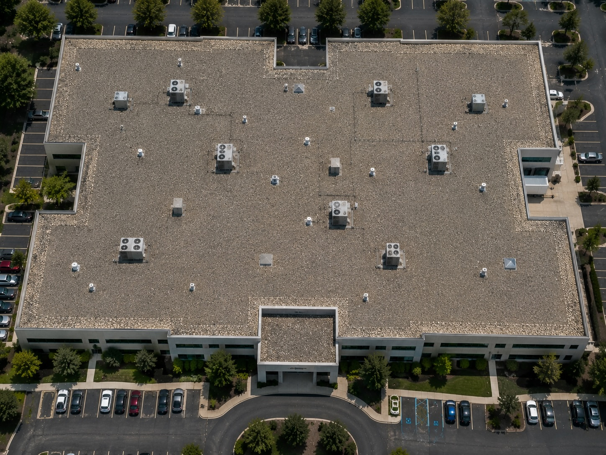
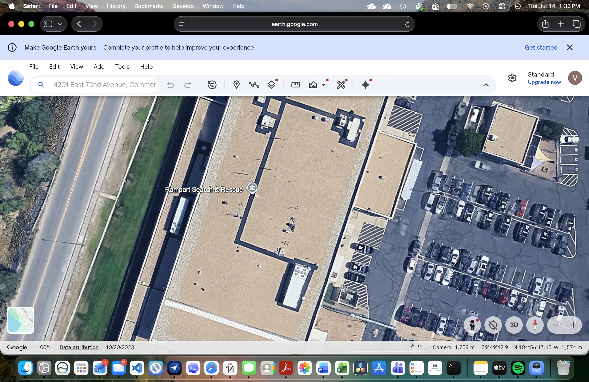

# Ballasted Roof Identification

## Purpose

Use this guide to identify ballasted low-slope roofing from aerial, drone, and inspection imagery. A ballasted roof uses loose stone, concrete pavers, or a combination of both to weigh down and protect an underlying roof assembly. The ballast is the visible surfacing or securement method; it does not, by itself, identify the waterproofing membrane beneath it.

Treat `ballasted roof` as a roof-zone classification rather than automatically assigning it to an entire building. A building may contain ballasted areas alongside exposed EPDM, TPO, PVC, modified bitumen, built-up roofing, metal, vegetated roofing, or other systems.

## Typical Characteristics

- Used primarily on low-slope and flat commercial roofs
- Loose river-washed stone, rounded gravel, concrete pavers, or both cover most of the roof field
- Aggregate commonly forms a continuous, intentionally distributed layer rather than isolated piles of debris
- Stone size, color, and depth may vary between the field, perimeter, corners, walkways, and equipment areas
- Larger or more densely placed ballast may occur at roof edges and corners for enhanced wind-uplift resistance
- Underlying membrane seams and field color are usually hidden
- Membrane or flashing may remain visible at parapets, curbs, penetrations, drains, scuppers, and areas where ballast has shifted
- Pavers may form walkways, service pads, perimeter zones, or the primary roof covering

Do not infer the hidden membrane type from ballast appearance. If the membrane is not exposed or documented, report it as indeterminate.

## Primary Visual Cues

Look for multiple cues that agree within a clearly bounded roof zone.

### Aggregate Surface

- Dense, continuous field of loose stone across most or all of a low-slope roof
- Repeated rounded or subrounded particles with visible three-dimensional texture
- Mottled gray, tan, brown, white, or mixed coloration rather than a smooth uniform membrane color
- No exposed sheet-lap grid across well-covered areas
- Natural variation between individual stones without the directional pattern of shingles, panels, or rolled membranes
- Local redistribution around drains, equipment, service routes, or wind-scoured areas may create uneven density

### Perimeter and Corner Pattern

- Deliberate band of larger stone, deeper ballast, or concrete pavers around roof edges
- Heavier or wider ballast zones at corners and other high-wind locations
- Clear transition from smaller field aggregate to larger perimeter stone
- Parapet or metal coping defining the outside boundary of the ballasted zone
- Perimeter treatment may be absent or subtle, so its absence does not exclude a ballasted roof

### Pavers and Walkways

- Regular square or rectangular concrete pavers laid in rows or grids
- Paver paths connecting roof access points with mechanical equipment
- Service pads or isolated paver groups beneath and around rooftop units
- Open joints between pavers and consistent modular dimensions
- Pavers may cover a protected membrane roof completely, with little or no loose stone visible

### Penetrations, Equipment, and Drainage

- Ballast stops short of some curbs, pipes, drains, and flashed transitions
- Exposed membrane or flashing may appear as a narrow smooth border around equipment and penetrations
- Drain bowls, sumps, and scuppers may create localized openings in the stone field
- Darker aggregate may indicate wetness, shadow, staining, or greater ballast depth rather than a different roof system
- Vegetation, sediment, or standing water between stones can indicate drainage patterns but does not define the roof type

### Roof Geometry and Context

- Broad commercial or institutional low-slope roof bounded by parapets
- Aggregate field follows the building outline and stops cleanly at roof-zone transitions
- Changes in elevation, expansion joints, additions, or parapets may separate ballasted and non-ballasted roof areas
- Rooftop equipment appears to rise through or sit within the aggregate field

## Strongest Evidence for a Ballasted Roof

Confidence increases when imagery shows several of the following together:

1. Continuous loose aggregate or modular pavers covering a low-slope roof field
2. An intentional, bounded distribution that follows the roof outline
3. Larger, deeper, or denser ballast at perimeters and corners
4. Ballast interrupted logically at drains, curbs, penetrations, and service paths
5. Small areas of smooth underlying membrane visible where stone has been held back or displaced

Stone-like texture alone is not enough. Confirm that the material is on the roof, intentionally distributed, and distinct from exposed aggregate in a built-up roof surface.

## Common Look-Alikes

### Gravel-Surfaced Built-Up Roofing

Built-up roofing may have aggregate embedded in an asphalt flood coat. Its surfacing often appears more bonded, flatter, darker, and less freely piled than loose ballast. Asphalt may be visible between stones, and there may be no deliberate larger-stone perimeter band. Aerial imagery may not reliably distinguish loose ballast from embedded aggregate; use `aggregate-surfaced low-slope roof` when the evidence is ambiguous.

### Protected Membrane or Inverted Roof Assembly

Protected membrane roofs also place insulation and ballast or pavers above the waterproofing. They can look identical to other ballasted assemblies from above. Classify the visible system as ballasted or paver-covered, but do not infer the layer order without records or inspection.

### Decorative Gravel or Plaza Surfacing

Decorative stone may occur in limited rooftop amenity or landscaping zones. Look for planters, occupied terraces, intentional borders, and partial coverage. Do not extend the classification beyond the contiguous stone-covered roof zone.

### Vegetated Roofing

Vegetated roofs show growing media, planted coverage, drainage borders, and seasonal color or texture. Stone may be used only as a perimeter fire or drainage strip. Classify the planted and stone-covered zones separately.

### Paver Decks and Rooftop Terraces

Occupied terraces may use architectural pavers over pedestals. Railings, furniture, walking patterns, and uniform finish favor a terrace classification, although a protected membrane may still exist below. Report the visible assembly and avoid assuming the waterproofing type.

### Deteriorated Asphalt or Coated Roofing

Alligatoring, coating texture, stains, and widespread patching can mimic fine aggregate at low resolution. True ballast normally shows individually resolved stones, irregular highlights and shadows, and recognizable accumulation around obstacles.

### Ground-Level Gravel Seen Through Roof Boundaries

Parking areas, landscaping, and adjacent lower roofs can be mistaken for a target roof. Confirm parapets, wall edges, elevation, shadows, and rooftop equipment before assigning a roof-zone label.

## What Cannot Usually Be Determined Visually

When ballast conceals the roof assembly, imagery alone generally cannot establish:

- Whether the hidden membrane is EPDM, TPO, PVC, built-up roofing, or another material
- Whether the membrane is adhered, mechanically secured, or loose-laid beneath the ballast
- Insulation type, attachment, layer order, or deck type
- Seam condition, punctures, trapped moisture, or deterioration beneath covered areas
- Exact ballast depth, weight per unit area, or compliance with wind-design requirements

Preserve these as unknowns unless close exposed details or reliable documentation resolves them.

## Mixed-Roof Buildings

Do not assign `ballasted roof` to the whole building merely because the largest roof area contains stone.

1. Divide the roof into contiguous zones using parapets, expansion joints, elevation changes, additions, paver boundaries, and abrupt changes in surface texture.
2. Evaluate ballast coverage, perimeter treatment, exposed membrane, seams, flashings, and drainage within each zone.
3. Assign a separate visible roof-system label and confidence to every zone.
4. Estimate each zone's share of visible roof area when practical.
5. Record whether the underlying waterproofing membrane is visible, likely, or indeterminate.
6. Keep stone perimeter strips, vegetated areas, terraces, and exposed membrane fields as separate zones when their construction differs.

Example result:

```text
Roof zone A — stone-ballasted low-slope roof; membrane indeterminate, 60%, high confidence
Roof zone B — exposed dark single-ply membrane, likely EPDM, 25%, medium confidence
Roof zone C — concrete-paver terrace over concealed assembly, 15%, medium confidence
Overall building — mixed roof types; no single whole-building classification
```

## Confidence Rules

### High Confidence

- Sharp imagery clearly resolves continuous loose stones or modular pavers on a bounded low-slope roof
- Distribution around edges, equipment, penetrations, and drainage is consistent with an intentional ballast system
- Multiple views or close details confirm the three-dimensional aggregate or paver surface
- Major look-alikes have been excluded by visible construction details

High confidence in a ballasted classification does not create confidence in the hidden membrane type.

### Medium Confidence

- The roof appears continuously aggregate-surfaced, but individual stones or their loose placement are only partly resolved
- A larger-stone perimeter or other supporting layout cue is visible
- Loose ballast and gravel-surfaced built-up roofing remain difficult to separate
- Zone boundaries are clear but underlying assembly details are hidden

### Low Confidence

- The decision depends mainly on mottled color or coarse-looking texture
- Image resolution does not resolve individual stones, pavers, or meaningful distribution patterns
- Shadow, vegetation, water, snow, debris, or compression obscures the surface
- The area could be a roof, terrace, ground-level gravel, or an aggregate-surfaced asphalt system

### Insufficient Evidence

Use `unknown/indeterminate roof type` when roof location or surfacing cannot be established. Use `aggregate-surfaced low-slope roof` when aggregate is visible but loose ballast cannot be distinguished from embedded gravel. Request closer oblique imagery, detail photographs, roof records, or an on-site inspection.

## Reference Images

The following repository images are positive ballasted-roof references. Use them to learn recurring distribution and texture patterns. Do not use them to infer a specific hidden membrane.

### Ballasted Reference 1



This comparison image shows six combinations of field and perimeter aggregate. Across the examples, smaller stone covers the main roof field while larger rounded stone forms a deliberate edge band. The stone colors and dimensions vary substantially, demonstrating that layout and texture are more reliable than color alone.

### Ballasted Reference 2



Visible cues include a dense field of smaller gray aggregate, a continuous band of larger rounded perimeter stone, and logical interruptions around rooftop equipment and penetrations. The regular roof boundary and intentional stone transition strongly support a ballasted classification.

### Ballasted Reference 3



Visible cues include a very large, contiguous aggregate-covered low-slope roof with a lighter and somewhat coarser perimeter band. Repeated equipment penetrations sit within the continuous stone field. Different apparent textures near the edge should be treated as ballast zones, not automatically as different membrane types.

### Ballasted Reference 4



Visible cues include continuous small field aggregate, larger light-colored stones around most of the complex perimeter, and consistent coverage around multiple rooftop units. The building's setbacks demonstrate how perimeter ballast can trace an irregular roof outline.

### Ballasted Reference 5



This is a closer positive view of the ballasted roof at **4201 E 72nd Ave**, corresponding to lower-resolution aerial targets of the same building. It shows a tan, continuously aggregate-covered main roof and smaller adjoining roof sections. The intentionally distributed granular field follows the roof boundaries, while lighter and coarser stone bands remain visible along portions of the perimeter. Dark lines around curbs, parapets, and equipment are boundary and flashing details within the ballasted assembly; they should not cause the broad aggregate-covered zones to be classified as TPO, PVC, or coating. When the lower-resolution image of this building makes the field look smooth, use this closer view to establish the visible system as ballasted rather than defaulting to TPO.

## Recommended AI Output

For every analyzed building, return:

- `building_classification`: single roof type, mixed roof types, or indeterminate
- `roof_zones`: zone identifier, location or polygon, visible system label, estimated area share, and confidence
- `ballast_type`: loose stone, pavers, mixed, or indeterminate
- `underlying_membrane`: identified material or indeterminate, with separate confidence
- `supporting_cues`: observed texture, distribution, perimeter, penetration, and boundary evidence
- `alternatives`: plausible look-alikes that remain
- `limitations`: resolution, angle, obstruction, weather, or concealed assembly details
- `verification_needed`: additional imagery, records, or inspection required to identify the hidden membrane

Never infer hidden membrane condition, remaining service life, structural loading, or warranty status from the visible ballast classification alone.
