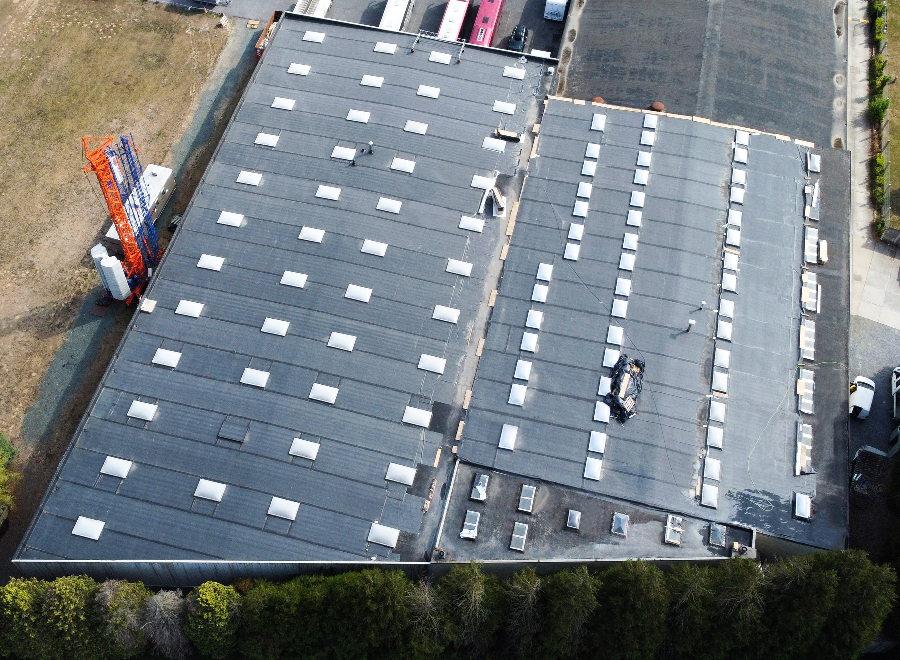
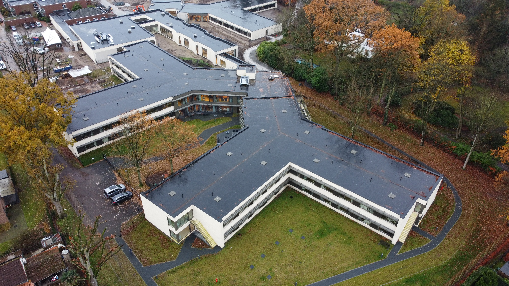
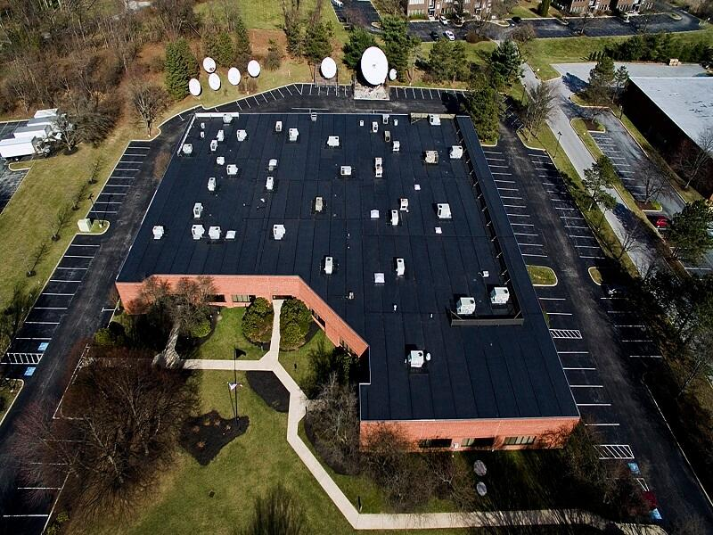
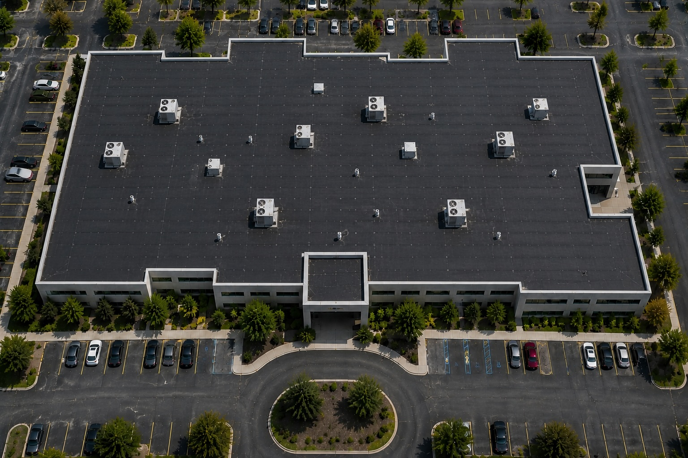

# EPDM Roof Identification

## Purpose

Use this guide to identify ethylene propylene diene monomer (EPDM) roofing from aerial, drone, and inspection imagery. Treat EPDM as a roof-zone classification. One building can contain EPDM and one or more other roofing systems, particularly where additions, reroofing phases, different elevations, or repairs created separate roof areas.

Image-only classification is an informed visual assessment. A dark low-slope roof is not automatically EPDM, and white EPDM can closely resemble TPO or PVC. Use a generic label such as `dark single-ply membrane, likely EPDM` when exact material evidence is unavailable.

## Typical Characteristics

- Flexible synthetic-rubber single-ply membrane used primarily on low-slope and flat roofs
- Most commonly black; white-faced and coated EPDM systems also exist
- Smooth to lightly textured sheet surface with a matte or low-sheen appearance
- Factory-made sheets joined with adhesive or seam tape rather than heat-welded field seams
- Available in large sheets, so field seams may be relatively widely spaced
- Installed as ballasted, mechanically attached, or fully adhered systems
- Flashings, cover strips, pipe boots, and repair patches often create visible layered details

Color is supporting evidence only. Dark roofs may also be modified bitumen, built-up roofing, asphaltic coatings, dark TPO or PVC, or coated systems. Ballast can hide EPDM completely.

## Primary Visual Cues

Look for multiple cues that agree with one another.

### Membrane Surface

- Black, charcoal, or dark gray continuous field in the most common EPDM configuration
- Smooth, rubber-like, matte surface without exposed stone or mineral granules
- Broad sheets that may show gentle wrinkles, ripples, or localized bridging
- Weathering, dirt, moisture, and oxidation can make black EPDM appear gray or uneven
- White-faced or coated EPDM may appear light colored and cannot be identified by the normal black-color cue

### Seam Pattern

- Long, straight lap seams separating broad membrane sheets
- Relatively wide sheet layout, sometimes with fewer field seams than roll roofing
- Tape or adhesive seams may read as dark or slightly raised bands in close or oblique imagery
- Cover strips and repairs can form wider rectangular bands or patches
- Field seams may be difficult to see on fully adhered systems or distant aerial images

### Edges, Curbs, and Penetrations

- Matching black or dark membrane flashing at parapets, curbs, and roof-to-wall transitions
- Layered boots, uncured flashing patches, seam tape, and cover strips around penetrations
- Rectangular or rounded repair patches that visibly overlap the field membrane
- Dark membrane may pull, bridge, wrinkle, or tent at inside corners and changes in plane as it ages
- Metal coping may conceal the top of the perimeter flashing

### Roof Geometry and Context

- Common on broad commercial, institutional, and industrial low-slope roofs
- Large sheets may cover long uninterrupted areas between parapets and elevation changes
- Internal drains, scuppers, and subtle tapered-insulation slopes may organize staining and water paths
- Additions, raised sections, expansion joints, and changes in seam direction can identify separate roof zones or installation phases

## Strongest Evidence for EPDM

Confidence increases when the image shows several of the following together:

1. A smooth black or charcoal single-ply field without granules or aggregate
2. Broad sheets separated by straight lap or tape seams
3. Matching dark rubber flashings and layered accessories at curbs and penetrations
4. Rubber-like wrinkles, bridging, cover strips, or overlapping repair patches in close imagery
5. Consistent construction across one clearly bounded roof zone

Dark color by itself is weak evidence. From a distant aerial view, it may be possible to identify only a dark membrane roof rather than EPDM specifically.

## Common Look-Alikes

### Modified Bitumen

Modified bitumen commonly appears black or gray but often uses narrower rolls with more frequent parallel laps. It may show mineral granules, a coarse asphalt texture, bleed-through, silver coating, or heavy layered flashing. EPDM typically reads as broader, smoother rubber sheets.

### Built-Up Roofing

Built-up roofing may have exposed gravel, embedded aggregate, flood-coat texture, or irregular asphalt surfacing. Smooth-surfaced built-up roofs can be difficult to separate from a coated or aged membrane without close detail.

### Dark TPO or PVC

Thermoplastic membranes can be gray or other dark colors. Their seams are heat welded and tend to be clean and low profile; exact separation from EPDM may require close seam details, manufacturer markings, or records.

### TPO or PVC Versus White EPDM

White-faced EPDM can closely resemble a white thermoplastic membrane. Heat-welded seams favor TPO or PVC; tape or adhesive laps and rubber flashing details favor EPDM. If those features are not resolved, report `white single-ply membrane` and preserve the alternatives.

### Reflective or Asphaltic Coatings

Coatings may mask the original roof material while preserving old seams, repairs, and substrate texture. Look for irregular roller or spray coverage, wear-through, and several underlying materials sharing the same surface color.

### Metal Roofing

Metal roofs show rigid panels, repeated raised ribs or standing seams, and directional reflection. EPDM lies flat and conforms to subtle substrate movement; its laps remain low-profile.

On mixed commercial buildings, a dark attached roof field should favor EPDM over metal when it appears flat and matte, reads as a broad continuous membrane, and lacks consistent raised-rib shadows, directional metal sheen, or crisp metal edge construction. Faint straight image features alone do not establish metal.

### Ballasted Membrane

Rounded stone ballast may cover EPDM, TPO, or another membrane. When the membrane is hidden, classify the visible roof as `ballasted low-slope roof; membrane type indeterminate` unless exposed areas or records establish the membrane.

## Mixed-Roof Buildings

Do not assign EPDM to the whole building merely because the largest or darkest roof area resembles EPDM.

1. Divide the roof into contiguous zones using parapets, expansion joints, elevation changes, additions, material transitions, and abrupt changes in color or seam geometry.
2. Evaluate the surface, sheet dimensions, seams, flashings, and edges inside each zone independently.
3. Assign a separate material label and confidence to every visible zone.
4. Estimate each zone's share of visible roof area when practical.
5. Record transition boundaries and any zones hidden by equipment, ballast, shadow, water, vegetation, or poor resolution.
6. When the zone is clearly a dark membrane but EPDM cannot be separated from modified bitumen, use `epdm_or_mod_bit`, displayed as **EPDM or Modified Bitumen**, rather than guessing.

Example result:

```text
Roof zone A — dark single-ply membrane, likely EPDM, 55%, medium confidence
Roof zone B — white thermoplastic single-ply membrane (TPO/PVC), 35%, medium confidence
Roof zone C — modified bitumen, 10%, medium confidence
Overall building — mixed roof types; no single whole-building classification
```

## Confidence Rules

### High Confidence

- Close, sharp imagery shows a rubber membrane, tape or adhesive lap seams, and EPDM-consistent flashing details
- Multiple independent cues agree within the roof zone
- Documentation or readable markings support the image classification
- Granular asphalt systems, thermoplastics, coatings, and other look-alikes have been excluded by non-color evidence

### Medium Confidence

- The surface is clearly a dark single-ply membrane with broad sheets and consistent seam or flashing patterns
- EPDM is the leading classification, but another smooth membrane or roof covering cannot be fully excluded
- Roof-zone boundaries are clear, but material details are near the image-resolution limit

### Low Confidence

- The decision depends mainly on black, charcoal, or gray color
- Seam and flashing details are unresolved
- Shadow, wetness, dirt, leaf cover, glare, ballast, or compression obscures the surface
- Multiple plausible dark roofing systems remain

### Insufficient Evidence

Use `unknown/indeterminate roof type` when the roof is substantially obscured or the imagery does not support a material family. Request closer oblique imagery, detail photographs, project records, or an on-site inspection.

## Reference Images

The following repository images are positive EPDM references. Use them to learn recurring patterns, but do not expect every EPDM roof to share their darkness, scale, age, or attachment pattern.

### EPDM Reference 1



Visible cues include broad dark-gray membrane fields, long parallel sheet lines, and repeated rectangular roof zones around numerous skylights. Variation between adjoining sections shows why each bounded roof area should be evaluated separately.

### EPDM Reference 2



Visible cues include large, matte dark-gray low-slope fields with dark perimeter detailing and relatively subtle seams. Wetness and leaf accumulation change the apparent color and texture, so surface tone should be interpreted with the weather context.

### EPDM Reference 3



Visible cues include a black continuous field, strong long parallel sheet divisions, broad rectangular membrane sections, and dark detailing around roof edges and equipment. This image provides a clear aerial example of seam geometry supporting the dark-color cue.

### EPDM Reference 4



Visible cues include a black, smooth roof field divided into broad rectangular sheets, repeated seam intersections, and dark matching construction around rooftop penetrations and equipment. The sheet dimensions and low-profile seam grid favor a single-ply membrane over narrow-roll asphalt roofing, although close details remain necessary to prove EPDM specifically.

## Recommended AI Output

For every analyzed building, return:

- `building_classification`: single roof type, mixed roof types, or indeterminate
- `roof_zones`: zone identifier, location or polygon, material label, estimated area share, and confidence
- `supporting_cues`: the observed features that support each label
- `alternatives`: plausible look-alikes that remain
- `limitations`: resolution, angle, obstruction, wetness, shadow, weather, or missing detail
- `verification_needed`: additional imagery or records required to confirm the exact membrane

Never infer roof condition, damage, remaining service life, or warranty status from the roof-type label alone.
