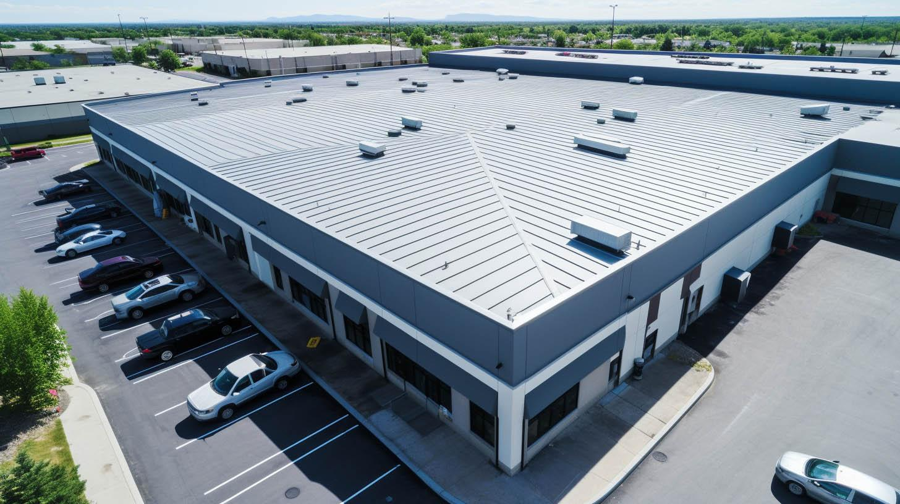
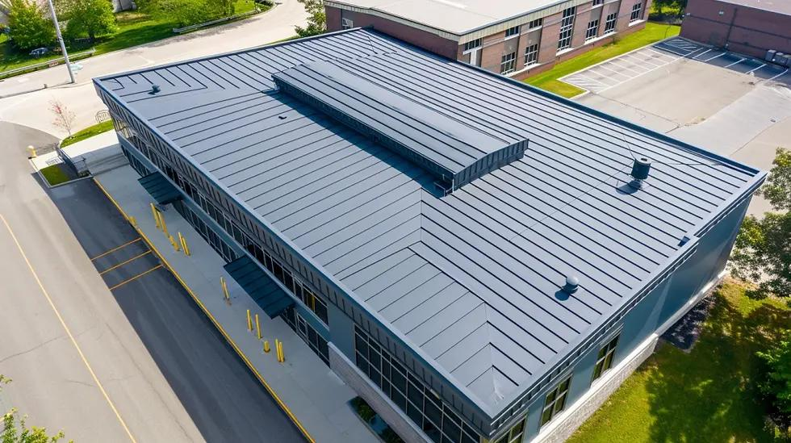
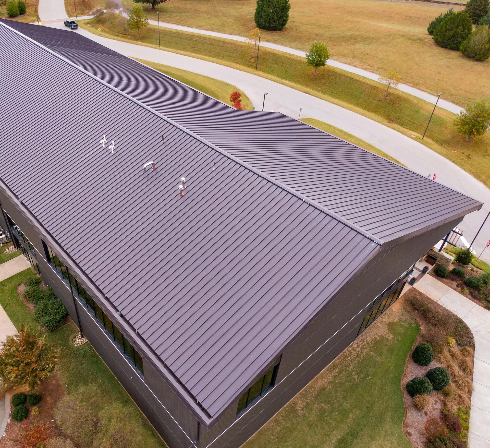
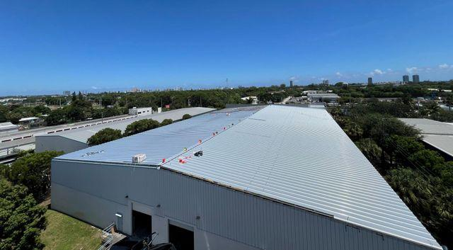
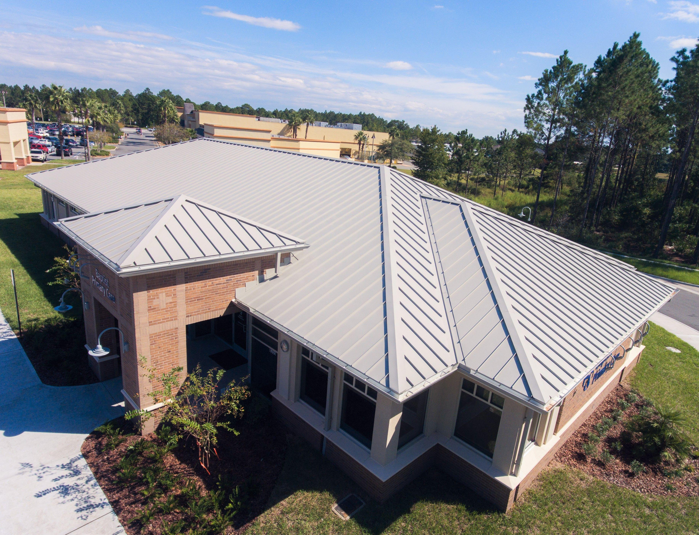
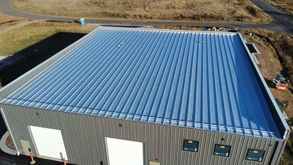

# Metal Roof Identification

## Purpose

Use this guide to identify metal roofing from aerial, drone, and inspection imagery. Treat metal as a roof-zone classification. A single building may have metal roof sections alongside membrane roofs, asphaltic low-slope systems, coatings, canopies, or other materials.

This guide covers standing-seam, exposed-fastener, corrugated, and other panelized metal roofs. The supplied positive references primarily show standing-seam systems and should not be treated as the complete range of metal-roof appearances.

The required roof-type output is always the canonical type `metal`. A possible subtype may be described in supporting observations only when the imagery clearly resolves the seam or rib profile and attachment pattern. If the image establishes metal but cannot distinguish standing seam from ribbed, corrugated, or another metal system, do not name a subtype.

Faint parallel lines, tonal bands, or rectangular image artifacts on a dark low-slope roof are not enough to establish metal. When rigid panel geometry, raised-rib shadows, and metal edge details are unresolved, do not guess metal. If the surface is plausibly a dark membrane, use EPDM, modified bitumen, or **EPDM or Modified Bitumen** according to the visible evidence and retain metal only as an alternative.

Soft overhead imagery may still support the generic metal family when narrow parallel panel lines are dense, regular, continuous across most of the roof field, and reinforced by rigid rectangular geometry and crisp perimeter construction. In that situation, keep confidence low to moderate because the image does not resolve rib height, attachment, or subtype. Do not apply this exception to a dark, flat, matte roof with only a few faint lines and no metal edge evidence; that appearance favors a membrane.

## Typical Characteristics

- Rigid panels made from steel, aluminum, zinc, copper, or another metal
- Repeated raised seams, ribs, corrugations, or panel joints
- Panels commonly run in the primary drainage direction
- Directional reflection or sheen that changes with sun and viewing angle
- Crisp ridges, hips, valleys, eaves, rakes, and edge trim
- Common on both low-slope commercial roofs and steeper architectural roofs
- Factory or field-applied finishes may be white, gray, black, bronze, red, green, or other colors

Color does not define metal roofing. Panel geometry and raised repetitive profiles are the strongest aerial cues.

## Primary Visual Cues

### Panel and Rib Pattern

- Long, straight, evenly spaced parallel raised ribs or standing seams
- Ribs normally run downslope from a ridge or high point toward an eave or gutter
- Consistent manufactured panel widths across a roof plane
- Panel ends, endlaps, or transverse joints may be visible on long roof runs
- Exposed-fastener roofs may show repeated fastener rows when resolution permits

### Surface and Reflection

- Smooth rigid planes with directional highlights
- Alternating light and shadow beside raised seams
- Sun glare may affect adjacent panels differently based on slope and orientation
- Painted finishes generally remain uniform within a roof plane, subject to fading, oxidation, and runoff staining

### Roof Geometry and Trim

- Defined ridge caps, hip caps, valley flashing, eave trim, rake trim, and gutters
- Straight folds and crisp changes in plane
- Snow guards, closures, curbs, and penetrations integrated into the panel layout
- On low-slope metal roofs, seams may continue across broad areas with subtle slope but still remain raised and regular

### Penetrations and Attachments

- Metal boots, curbs, or flashing integrated around vents and equipment
- Penetrations may align between ribs or require framed curb details
- Rooftop attachments may use clamps fixed to standing seams rather than penetrating the panel face

## Strongest Evidence for Metal

Confidence increases when a roof zone shows:

1. Repeated raised parallel seams or ribs with consistent spacing
2. Rigid panels following clear drainage planes
3. Directional highlight and shadow along the ribs
4. Metal ridge, hip, valley, eave, and rake trim
5. Penetration details integrated into the panel geometry

## Common Look-Alikes

### TPO, PVC, or EPDM Membrane

Single-ply membranes can have long parallel laps, but those seams are low profile and usually do not cast consistent rib shadows. Membranes conform to insulation and substrate irregularities; metal forms rigid panels with crisp trim. Mechanically attached membrane rows can resemble metal from poor imagery, so confirm rib height, spacing, and drainage direction.

### Coated Metal Roof

A coating does not change the metal substrate classification when panel ribs and rigid geometry remain visible. Report both layers when supported, such as `coated metal roof`. Heavy restoration systems may soften rib detail or bridge fasteners and endlaps.

### Ribbed Wall Panels, Canopies, and Mechanical Screens

Confirm that the panelized surface is a roof plane rather than siding, a screen, or an isolated canopy. Use building edges, slope, elevation, drainage, and shadows.

### Corrugated Fiber-Cement or Translucent Panels

Nonmetal corrugated products may share repeated ribs. Differences may require close imagery, edge profiles, material translucency, weathering patterns, or records. Use `corrugated panel roof; material indeterminate` when necessary.

### Solar Panels

Solar arrays have repeated dark modules with grid-like frames mounted above another roof. They do not normally continue into ridge, eave, valley, and perimeter trim as the weathering roof surface.

## Metal-System Subtypes

### Standing Seam

- Narrow raised seams with concealed attachment
- Long uninterrupted panels and clean flat pans
- Common on architectural roofs and many low-slope commercial systems

### Exposed-Fastener or Through-Fastened Panels

- More frequent ribs or corrugations
- Repeated exposed fasteners across panel faces when close enough to resolve
- Transverse endlaps may be more apparent

### Corrugated Metal

- Repeating wave, trapezoidal, or ribbed profile across the full panel
- Strong alternating highlight-shadow pattern

Do not assign a subtype when image resolution shows only a generic ribbed metal surface.

## Mixed-Roof Buildings

1. Divide the building into roof planes and contiguous zones using ridges, parapets, elevation changes, additions, and material transitions.
2. Classify each zone independently; canopies and entrance roofs may differ from the main roof.
3. Record metal subtype only where its attachment and profile are visible.
4. Estimate each zone's share of visible roof area and assign a separate confidence.
5. Preserve exposed membrane, coated areas, and low-slope interior zones as separate classifications.

Example result:

```text
Roof zone A — metal, 60%, high confidence; subtype visible as standing seam
Roof zone B — white single-ply membrane, 35%, medium confidence
Roof zone C — metal entrance canopy, 5%, high confidence
Overall building — mixed roof types
```

## Confidence Rules

### High Confidence

- Repeated raised seams, rigid panels, and metal edge or ridge trim are clearly visible
- Multiple roof planes show consistent panel construction
- Oblique imagery confirms rib height and panel geometry

### Medium Confidence

- Parallel panel-like lines and directional reflection are visible
- Metal is the leading material, but rib height or attachment is near the resolution limit
- The roof type is clear while the metal subtype is uncertain

### Low Confidence

- Only parallel lines or a reflective surface are visible
- Image angle, glare, shadow, or compression could turn membrane seams into apparent ribs
- Softness or compression prevents the viewer from confirming that apparent panel lines are physically raised
- The surface could be another corrugated or coated material

### Insufficient Evidence

Use `panelized roof; material indeterminate` or `unknown roof type` when panel material or roof location cannot be established. Request closer oblique imagery, edge details, or records.

## Reference Images

### Metal Reference 1



Visible cues include a broad low-slope commercial roof with dense parallel standing seams, directional rib shadows, rigid panel geometry, and integrated metal perimeter trim.

### Metal Reference 2



Visible cues include dark standing-seam panels running consistently across several low-slope roof planes, crisp hips and valleys, and a raised central roof section using the same panel system.

### Metal Reference 3



Visible cues include long dark panels, narrow raised seams running downslope, a continuous ridge, and crisp eave and rake edges. The changing seam direction follows the separate drainage planes.

### Metal Reference 4



Visible cues include a light industrial gable roof with closely repeated ribs, a clear ridge line, rigid straight eaves, and strong directional surface reflection.

### Metal Reference 5



Visible cues include multiple intersecting standing-seam roof planes, carefully resolved hips and valleys, consistent panel widths, and light-colored metal trim.

### Metal Reference 6



Visible cues include a simple gable warehouse roof with repeated full-length ribs, strong alternating highlights and shadows, and straight metal perimeter edges.

## Recommended AI Output

Return the building classification; separate roof zones and planes; metal subtype when supported; estimated area share; confidence; supporting panel, rib, reflection, and trim cues; plausible alternatives; and image limitations. Never infer metal gauge, alloy, coating specification, attachment, structural capacity, condition, or warranty from aerial appearance alone.
