# Metal Roof Identification

## Purpose

Use this guide to identify metal roofing from aerial, drone, and inspection imagery. Treat metal as a roof-zone classification. A single building may have metal roof sections alongside membrane roofs, asphaltic low-slope systems, coatings, canopies, or other materials.

This guide covers standing-seam, exposed-fastener, corrugated, and other panelized metal roofs. The supplied positive references primarily show standing-seam systems and should not be treated as the complete range of metal-roof appearances.

The required roof-type output is always the canonical type `metal`. A possible subtype may be described in supporting observations only when the imagery clearly resolves the seam or rib profile and attachment pattern. If the image establishes metal but cannot distinguish standing seam from ribbed, corrugated, or another metal system, do not name a subtype.

Faint parallel lines, tonal bands, or rectangular image artifacts on a dark low-slope roof are not enough to establish metal. When rigid panel geometry, raised-rib shadows, and metal edge details are unresolved, do not guess metal. If the surface is plausibly a dark membrane, use EPDM, modified bitumen, or **EPDM or Modified Bitumen** according to the visible evidence and retain metal only as an alternative.

Irregular weathering streaks, coating wear, runoff marks, patch edges, and roller or application marks are also not metal ribs. These marks break, change width or direction, and lack a repeated raised shadow. Require a coherent manufactured pattern reinforced by rigid roof planes, slope alignment, or metal perimeter/ridge construction before selecting metal. A weathered asphaltic-looking field without those cues should be compared directly with modified bitumen and coating.

For this aerial workflow, metal requires two target-image findings together: dense, narrow, uniformly repeated manufactured raised ribs and rigid pitched geometry, normally a visible peak or raised ridge with those ribs running perpendicular downslope. Do not use a rectangular footprint, white color, dense linear banding, broad sheet seams, attachment rows, or similarity to a metal reference as a substitute. A continuous smooth flat field without both required findings is not metal.

A shallow metal gable can look nearly flat in direct overhead imagery. Look for a
continuous raised ridge line through the roof center and dense narrow ribs that
terminate perpendicular to it on the opposing planes. This combined geometry is
stronger than color or apparent pitch alone. Uniform contrasting rectangles that
occupy one or more complete panel-bay widths and align exactly with the rib grid
may be replaced metal panel sections. Treat those as prior repair evidence while
preserving the metal classification. Irregular membrane patches do not establish
a rigid center ridge or a repeated perpendicular rib assembly.

Metal roofs commonly drain over exposed eaves or rakes and may show gutters,
downspouts, or crisp shedding-edge trim instead of an enclosing perimeter
parapet. When the image clearly resolves those edges, they reinforce a pitched
metal interpretation because they agree with the ridge, opposing planes, and
downslope rib direction. Apparent parapet absence alone is not a material test:
overhead imagery may hide a low wall or coping, and membrane roofs can also use
exposed drainage edges. Never override contradictory field geometry from this
edge cue or report parapet presence or absence as a customer-facing conclusion.

Soft overhead imagery does not create a metal exception. If the image cannot resolve raised rib height, narrow repeated spacing, pitched planes, and the ridge-to-rib relationship, do not classify the zone as metal. Retain metal only as an alternative when appropriate and select the supported membrane/coating family.

## Typical Characteristics

- Rigid panels made from steel, aluminum, zinc, copper, or another metal
- Repeated raised seams, ribs, corrugations, or panel joints
- Panels commonly run in the primary drainage direction
- Directional reflection or sheen that changes with sun and viewing angle
- Crisp ridges, hips, valleys, eaves, rakes, and edge trim
- Exposed water-shedding eaves or rakes, sometimes with gutters or downspouts, when clearly resolved
- Common on both low-slope commercial roofs and steeper architectural roofs
- Factory or field-applied finishes may be white, gray, black, bronze, red, green, or other colors

Color does not define metal roofing. Panel geometry and raised repetitive profiles are the strongest aerial cues.

In direct overhead imagery, classic ribbed metal may appear as a broad, uniform
tan, gray, or other colored field crossed by many fine, low-contrast, perfectly
regular parallel lines. Do not dismiss those lines merely because the rib
shadows are soft. When the lines remain evenly spaced and continuous across
large connected roof sections, align with the roof-plane geometry, and repeat
on adjacent physically connected sections, they are strong evidence of a
ribbed metal roof. Confirm that the pattern belongs to the target building and
is not a raster, compression, parking-lot, or neighboring-roof artifact.

## Primary Visual Cues

### Panel and Rib Pattern

- Long, straight, evenly spaced parallel raised ribs or standing seams
- Ribs normally run downslope from a ridge or high point toward an eave or gutter
- Consistent manufactured panel widths across a roof plane
- Panel ends, endlaps, or transverse joints may be visible on long roof runs
- Exposed-fastener roofs may show repeated fastener rows when resolution permits

### Surface and Reflection

- Smooth rigid planes with directional highlights
- Alternating light and shadow beside raised seams
- Sun glare may affect adjacent panels differently based on slope and orientation
- Painted finishes generally remain uniform within a roof plane, subject to fading, oxidation, and runoff staining

### Roof Geometry and Trim

- Defined ridge caps, hip caps, valley flashing, eave trim, rake trim, and gutters
- Straight folds and crisp changes in plane
- Snow guards, closures, curbs, and penetrations integrated into the panel layout
- On low-slope metal roofs, seams may continue across broad areas with subtle slope but still remain raised and regular

### Penetrations and Attachments

- Metal boots, curbs, or flashing integrated around vents and equipment
- Penetrations may align between ribs or require framed curb details
- Rooftop attachments may use clamps fixed to standing seams rather than penetrating the panel face

## Strongest Evidence for Metal

Confidence increases when a roof zone shows:

1. Repeated raised parallel seams or ribs with consistent spacing
2. Rigid panels following clear drainage planes
3. Directional highlight and shadow along the ribs
4. Metal ridge, hip, valley, eave, and rake trim
5. Penetration details integrated into the panel geometry

## Common Look-Alikes

### TPO, PVC, or EPDM Membrane

Single-ply membranes can have long parallel laps, but those seams are low profile and usually do not cast consistent rib shadows. Membranes conform to insulation and substrate irregularities; metal forms rigid panels with crisp trim. Mechanically attached membrane rows can resemble metal from poor imagery, so confirm rib height, spacing, and drainage direction.

A smooth white, apparently flat field with broad rectangular sheet divisions and no visible peak ridge or perpendicular narrow raised ribs belongs in the white single-ply/coating family. Do not reinterpret its broad seam grid as fine metal ribbing because a bright metal reference has similar color or building proportions.

### Coated Metal Roof

A coating does not change the metal substrate classification when panel ribs and rigid geometry remain visible. Report both layers when supported, such as `coated metal roof`. Heavy restoration systems may soften rib detail or bridge fasteners and endlaps.

### Translucent Fiberglass Skylight Panels

Industrial metal roofs may replace selected metal panel segments with translucent
fiberglass panels that admit daylight. From above, these commonly appear as
narrow rectangles with the same orientation, similar dimensions, regular spacing,
and alignment within the surrounding rib grid. They may be only slightly darker
than a bright roof and may lack a prominent raised curb. An organized repeated
array supports skylights; isolated rectangles with irregular sizes, locations, or
overlap edges are more likely repairs, coating variation, equipment, or artifacts.

When fiberglass skylight panels are supported, report `skylights: present`. For a
silicone-restoration recommendation, explicitly exclude the light-transmitting
panel faces from coating and require them to be masked and protected. Coating the
faces would make them opaque and can make these fragile fall-through hazards more
difficult to identify. Field inspection must evaluate panel and perimeter-seal
condition and establish safe access and treatment details.

### Ribbed Wall Panels, Canopies, and Mechanical Screens

Confirm that the panelized surface is a roof plane rather than siding, a screen, or an isolated canopy. Use building edges, slope, elevation, drainage, and shadows.

### Corrugated Fiber-Cement or Translucent Panels

Nonmetal corrugated products may share repeated ribs. Differences may require close imagery, edge profiles, material translucency, weathering patterns, or records. Use `corrugated panel roof; material indeterminate` when necessary.

### Solar Panels

Solar arrays have repeated dark modules with grid-like frames mounted above another roof. They do not normally continue into ridge, eave, valley, and perimeter trim as the weathering roof surface.

## Metal-System Subtypes

### Standing Seam

- Narrow raised seams with concealed attachment
- Long uninterrupted panels and clean flat pans
- Common on architectural roofs and many low-slope commercial systems

### Exposed-Fastener or Through-Fastened Panels

- More frequent ribs or corrugations
- Repeated exposed fasteners across panel faces when close enough to resolve
- Transverse endlaps may be more apparent

### Corrugated Metal

- Repeating wave, trapezoidal, or ribbed profile across the full panel
- Strong alternating highlight-shadow pattern

Do not assign a subtype when image resolution shows only a generic ribbed metal surface.

## Mixed-Roof Buildings

1. Divide the building into roof planes and contiguous zones using ridges, parapets, elevation changes, additions, and material transitions.
2. Classify each zone independently; canopies and entrance roofs may differ from the main roof.
3. Record metal subtype only where its attachment and profile are visible.
4. Estimate each zone's share of visible roof area and assign a separate confidence.
5. Preserve exposed membrane, coated areas, and low-slope interior zones as separate classifications.

Example result:

```text
Roof zone A — metal, 60%, high confidence; subtype visible as standing seam
Roof zone B — white single-ply membrane, 35%, medium confidence
Roof zone C — metal entrance canopy, 5%, high confidence
Overall building — mixed roof types
```

## Confidence Rules

### High Confidence

- Repeated raised seams, rigid panels, and metal edge or ridge trim are clearly visible
- Multiple roof planes show consistent panel construction
- Oblique imagery confirms rib height and panel geometry

### Medium Confidence

- Parallel panel-like lines and directional reflection are visible
- Metal is the leading material, but rib height or attachment is near the resolution limit
- The roof type is clear while the metal subtype is uncertain

### Low Confidence

- Only parallel lines or a reflective surface are visible
- Image angle, glare, shadow, or compression could turn membrane seams into apparent ribs
- Softness or compression prevents the viewer from confirming that apparent panel lines are physically raised
- The surface could be another corrugated or coated material

### Insufficient Evidence

Use `panelized roof; material indeterminate` or `unknown roof type` when panel material or roof location cannot be established. Request closer oblique imagery, edge details, or records.

## Reference Images

### Metal Reference 1

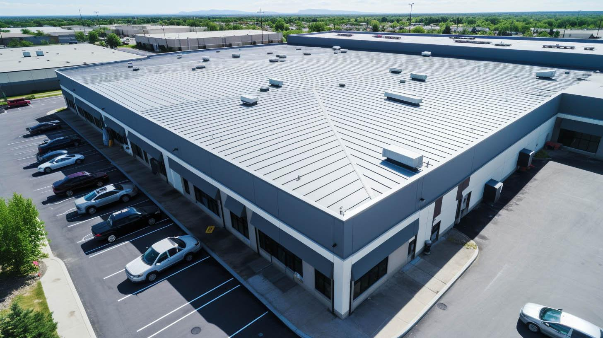

Visible cues include a broad low-slope commercial roof with dense parallel standing seams, directional rib shadows, rigid panel geometry, and integrated metal perimeter trim.

### Metal Reference 2

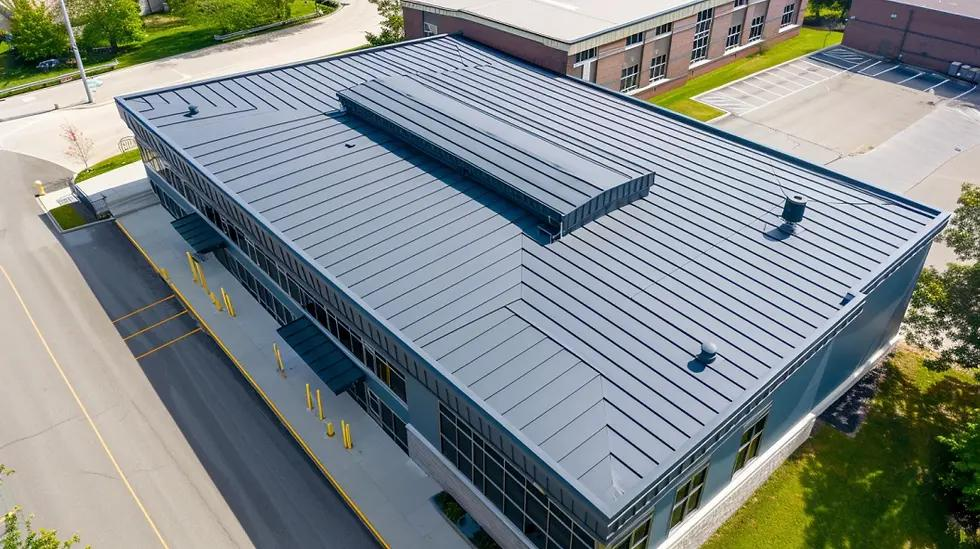

Visible cues include dark standing-seam panels running consistently across several low-slope roof planes, crisp hips and valleys, and a raised central roof section using the same panel system.

### Metal Reference 3

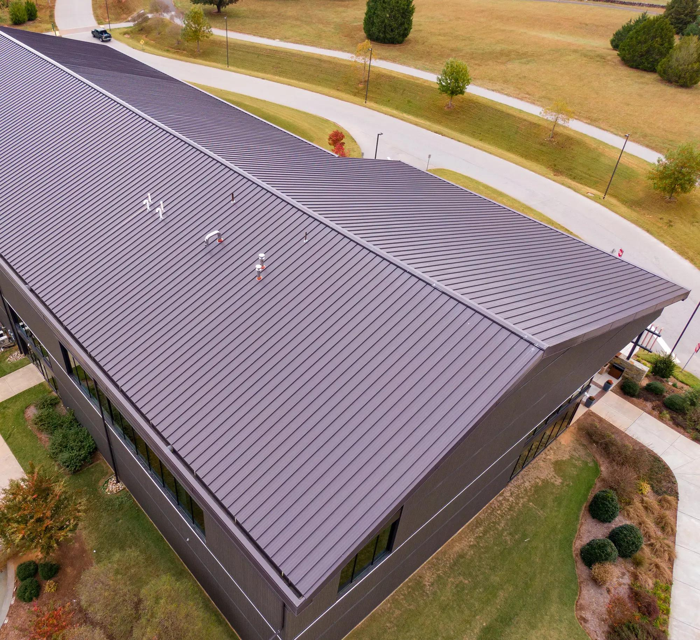

Visible cues include long dark panels, narrow raised seams running downslope, a continuous ridge, and crisp eave and rake edges. The changing seam direction follows the separate drainage planes.

### Metal Reference 4

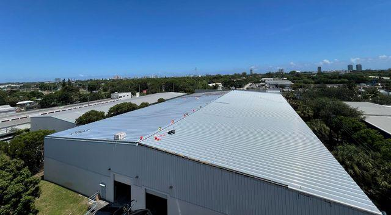

Visible cues include a light industrial gable roof with closely repeated ribs, a clear ridge line, rigid straight eaves, and strong directional surface reflection.

### Metal Reference 5

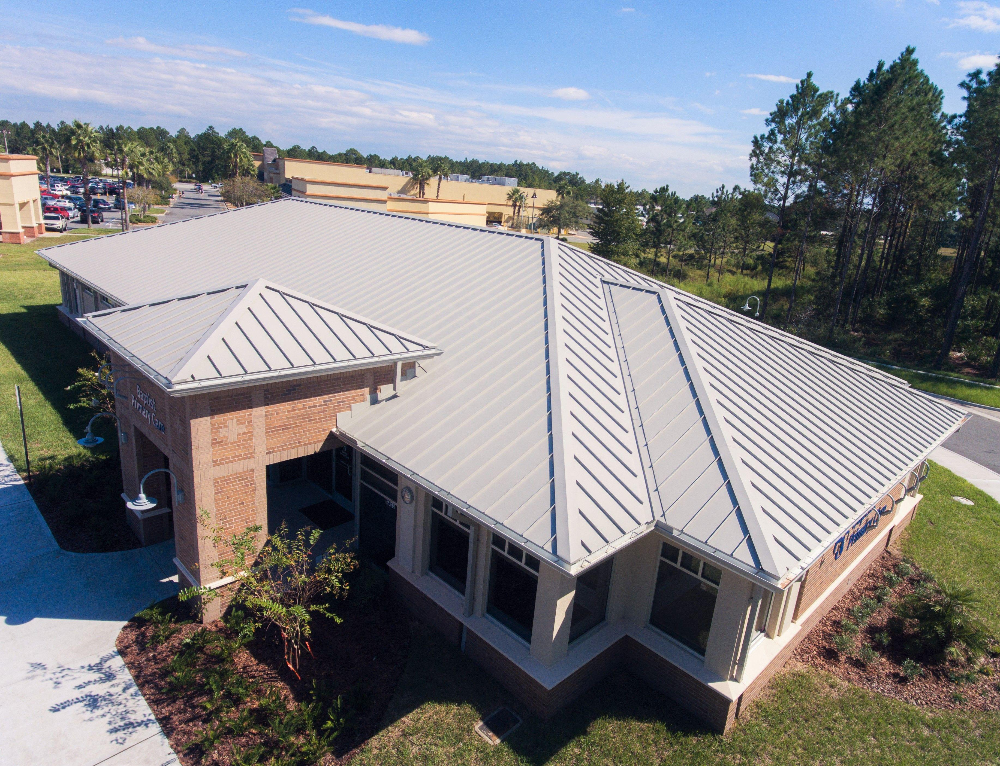

Visible cues include multiple intersecting standing-seam roof planes, carefully resolved hips and valleys, consistent panel widths, and light-colored metal trim.

### Metal Reference 6

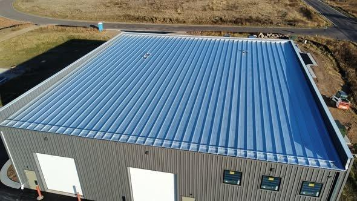

Visible cues include a simple gable warehouse roof with repeated full-length ribs, strong alternating highlights and shadows, and straight metal perimeter edges.

### Metal Reference 7 — Classic Ribbed Metal in Direct Overhead Imagery

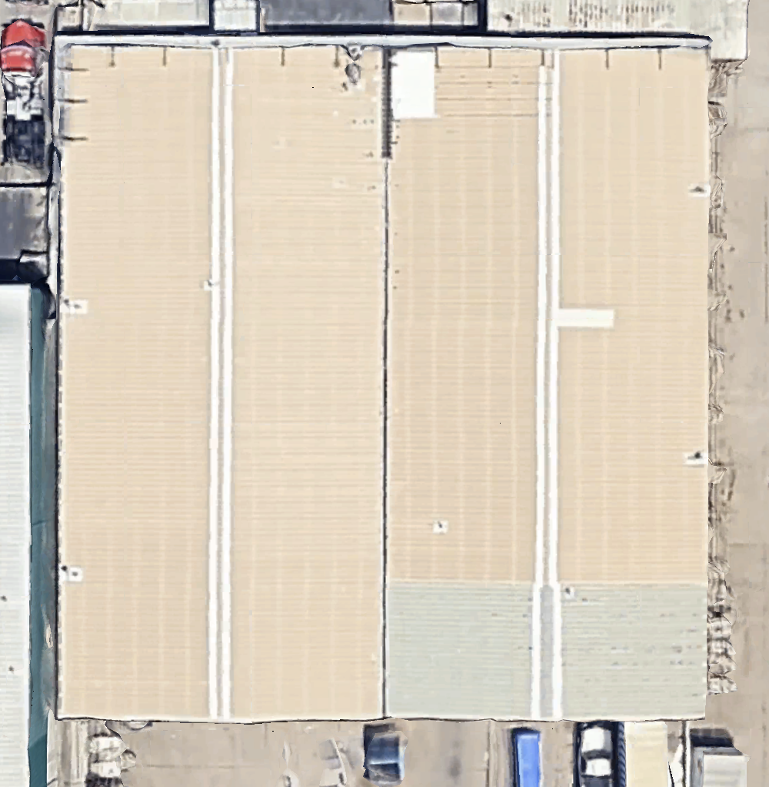

This user-confirmed metal example shows a large, light-tan industrial roof in a
direct overhead aerial image. The defining cue is the dense field of fine,
evenly spaced, parallel ribs that continues consistently across the broad
connected roof sections. The finish color varies between tan and pale
gray-green, demonstrating that color and weathering are secondary to the
manufactured rib pattern. The broad white linear features separate roof
sections or transitions; they should not be confused with the much finer,
repetitive metal ribs. Ignore the unrelated neighboring roofs visible beyond
the target building perimeter.

### Metal Reference 8 — Weathered Ribbed Metal Misread as Modified Bitumen

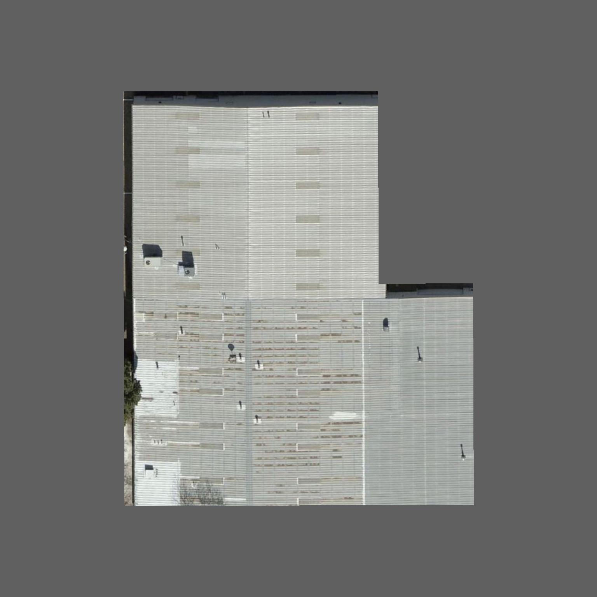

This reviewer-confirmed metal roof has a light, weathered finish with extensive
repair and coating wear that can superficially resemble aged modified bitumen.
The decisive evidence is the dense set of straight, evenly spaced ribs that
continues across each rigid roof plane. Several sections also show consistent
slope and drainage direction, crisp plane boundaries, and uninterrupted
manufactured rib geometry. Modified-bitumen roll laps are low-profile sheet
seams and do not create this full-field raised-rib pattern across sloped,
rigidly defined planes. Treat discoloration and repairs as condition evidence,
not as evidence that the substrate is asphaltic.

### Metal Reference 9 — Bright Ribbed Metal Misread as White Single-Ply

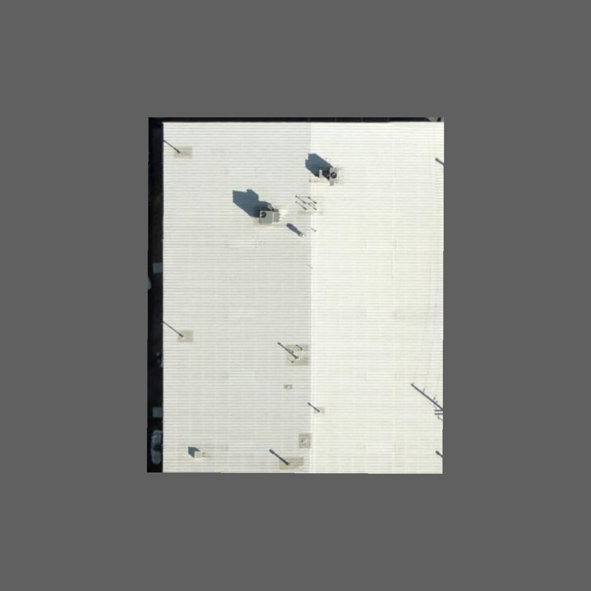

This reviewer-confirmed metal roof has a bright white finish that can trigger a
superficial white-membrane comparison. The decisive evidence is the dense set of
fine, straight, uniformly spaced ribs continuing across the full rigid roof
plane. This is manufactured metal-panel geometry, not the broader low-profile
sheet layout expected from TPO or PVC. Localized contrasting patches are visible
around several penetrations and curbs. Those patches indicate prior repair
activity and elevated flashing or seal leakage risk but do not prove an active
leak. The continuous metal field may be a strong silicone-restoration candidate
if onsite inspection, moisture and adhesion testing, substrate compatibility,
repairs, preparation, and manufacturer requirements are satisfied.

### Metal Reference 10 — Ribbed Metal with Fiberglass Skylight Panels

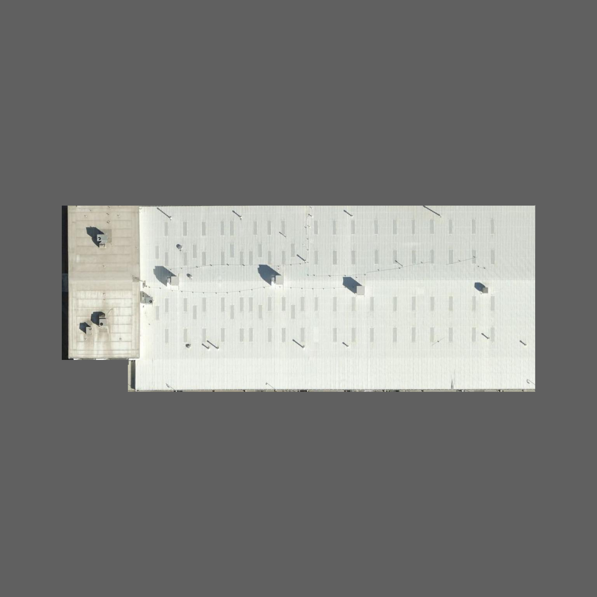

This reviewer-confirmed example shows a dominant bright ribbed metal roof and a
smaller attached modified-bitumen section at the west side. Across the main metal
field, numerous narrow rectangular panels are arranged in repeated rows. Their
consistent size, orientation, spacing, and alignment with the surrounding ribs
identify them as translucent fiberglass skylight panels rather than patches or
coating wear. Report skylights as present. Any silicone-restoration scope must
mask, protect, and exclude their light-transmitting faces while separately
inspecting their perimeter seals and condition.

### Metal Reference 11 — Shallow Center Ridge and Replaced Panel Sections

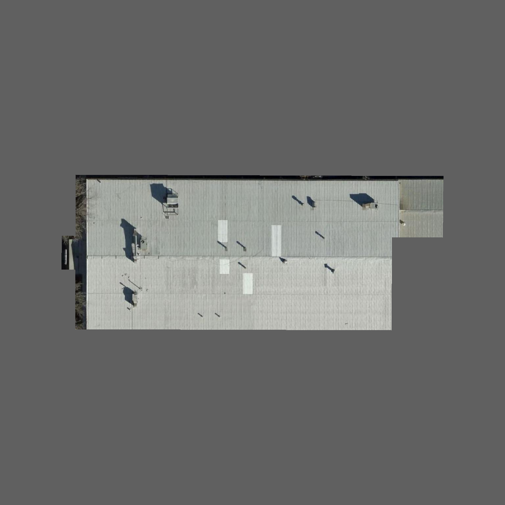

This reviewer-confirmed metal roof was previously confused with modified bitumen
or coating. The full field contains very narrow, uniformly spaced ribs. A raised
ridge runs across the center, dividing two shallow planes, while the ribs on each
plane terminate perpendicular to it. Several bright rectangles have consistent
panel-bay widths and align precisely with the rib grid; these are replacement
metal panel sections and evidence of prior repairs, not irregular membrane
patches. The center-ridge, opposing-plane, and panel-module evidence together
establish metal even though the roof appears nearly flat from overhead.

### Metal Reference 12 — Two-Tone Pitched Metal with Fiberglass Skylights

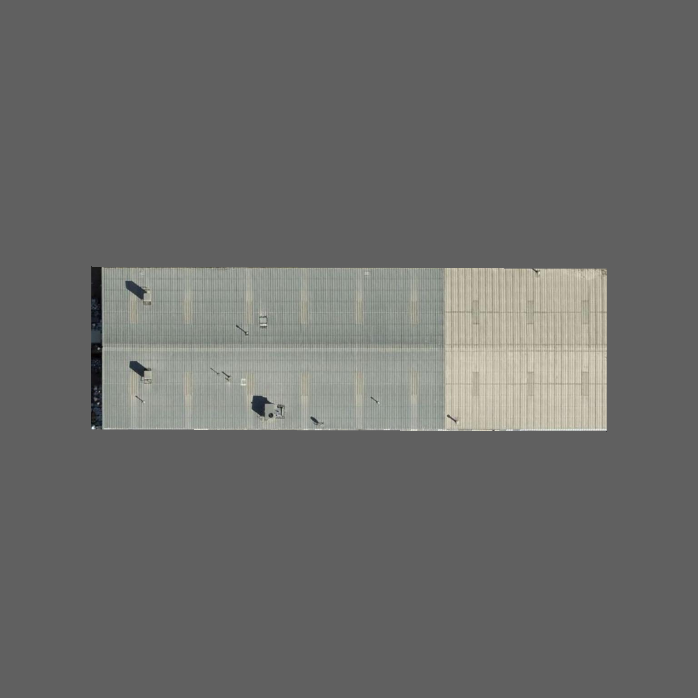

This reviewer-confirmed roof is entirely metal. A clear peak ridge divides two
pitched planes, and dense straight manufactured ribs run perpendicular to that
ridge across both the blue-gray and cream sections. The continuous ridge,
matching pitch, rib direction, spacing, and rigid panel construction establish
one material despite the strong color boundary. The two tones may reflect
different installation dates, panel replacement, coating age, finish, or
weathering, but the aerial image does not establish which explanation is
correct. Repeated lighter rectangular panels preserve consistent dimensions,
spacing, orientation, and alignment within the rib grid; identify them as
translucent fiberglass skylights rather than separate roofing or repairs.

### Metal Reference 13 — Bright White Ridged Metal Misread as Single-Ply

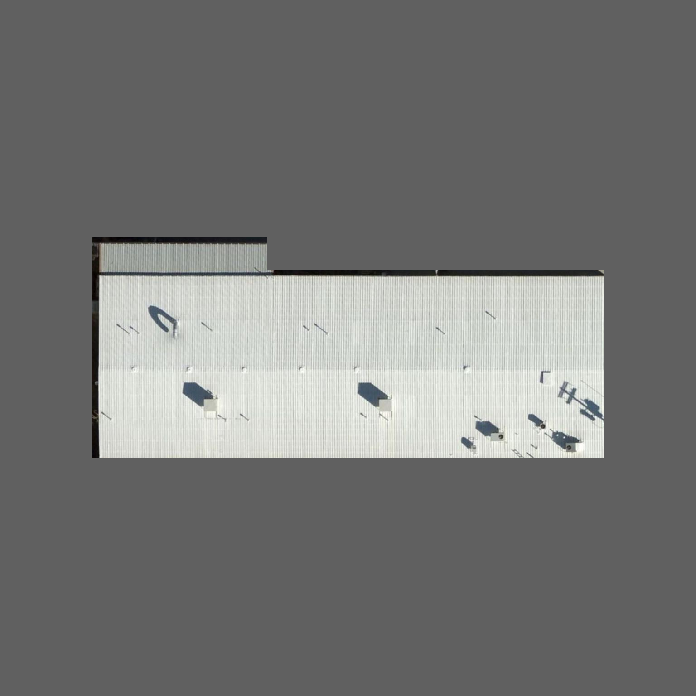

This reviewer-confirmed metal roof was incorrectly divided into a dominant
white single-ply field and a small metal section. The entire bright-white roof
is one continuous metal-panel assembly. A center ridge crosses the roof and
divides two shallow pitched planes, while dense narrow manufactured ribs run
perpendicular downslope from the ridge across both planes. The exposed eave and
rake geometry is configured to shed water and may include gutter or drainage-edge
details, reinforcing the pitched construction. That edge evidence is supportive,
not decisive by itself: the ridge, opposing planes, and perpendicular full-field
ribs establish metal, and the white finish must not create a membrane zone.

## Recommended AI Output

Return the building classification; separate roof zones and planes; metal subtype when supported; estimated area share; confidence; supporting panel, rib, reflection, and trim cues; plausible alternatives; and image limitations. Never infer metal gauge, alloy, coating specification, attachment, structural capacity, condition, or warranty from aerial appearance alone.
