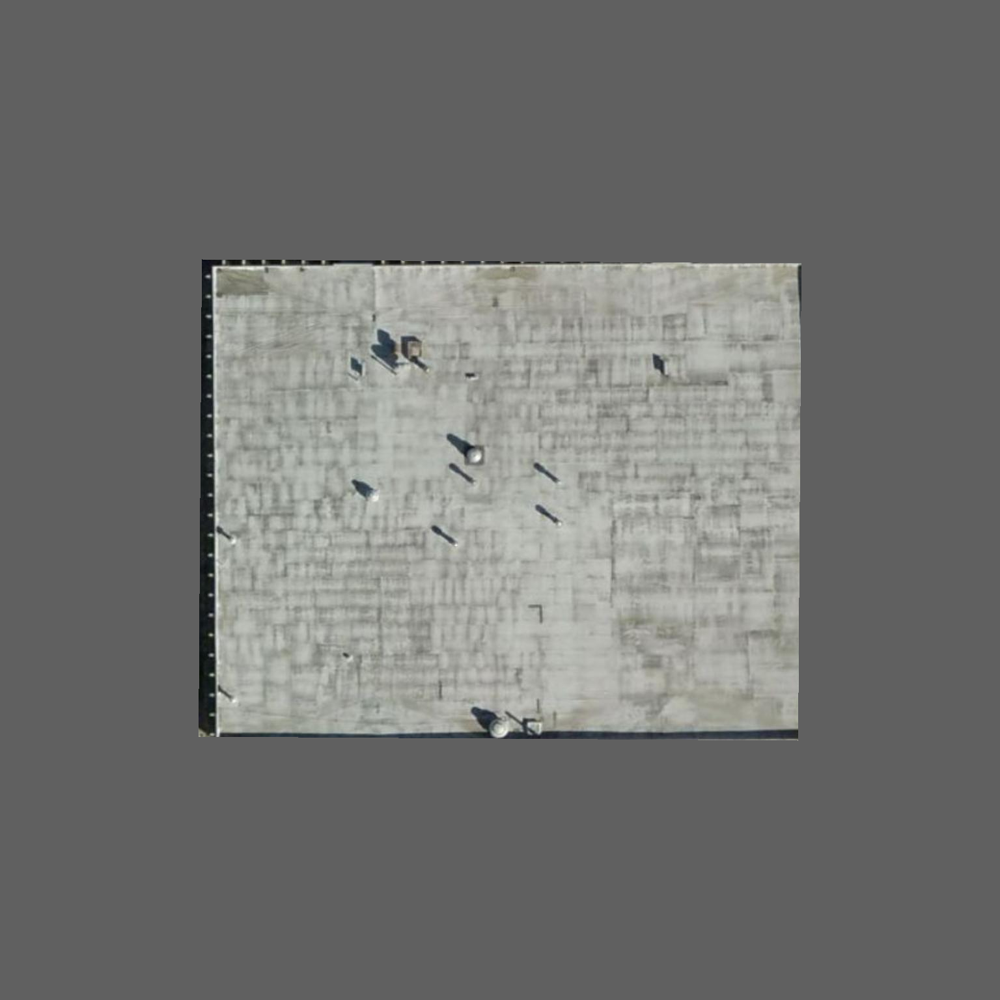
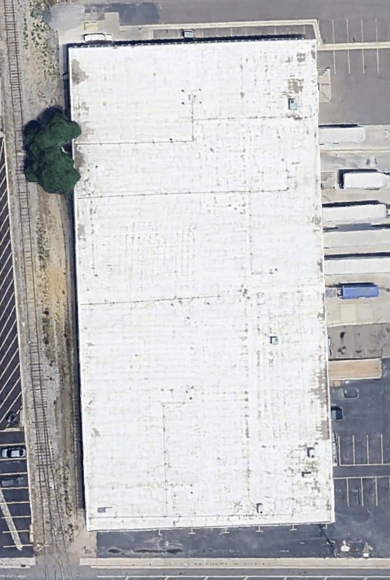
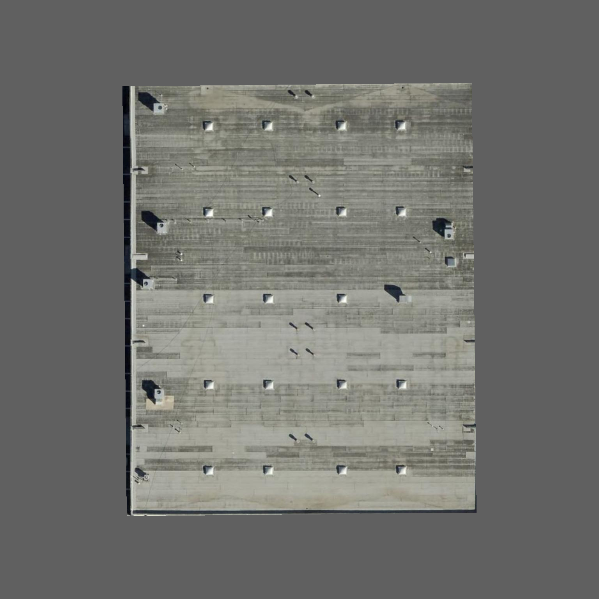

# Modified Bitumen Roof Damage Identification

## Description

This file provides a starting reference for identifying and documenting visible damage on modified bitumen roof surfaces. Modified bitumen systems typically use asphalt-based cap sheets reinforced with polyester or fiberglass and may have granulated, smooth, coated, or foil-faced surfaces. Damage observations may include splits, cracks, blisters, open laps, granule loss, exposed reinforcement, punctures, ridging, surface erosion, failed flashing, and deteriorated repairs.

## Why It's Important

Modified bitumen roofing relies on continuous plies, bonded laps, sound flashings, and a protective surface to resist water, ultraviolet exposure, and thermal movement. Cracks, open seams, blisters, and worn cap sheets can expose reinforcement or allow water into lower plies and insulation. Early identification supports targeted repairs, reduces moisture migration, preserves recover or coating options, and improves condition and service-life estimates.

## Visual Characteristics

### Aging

- Granule loss, bare asphalt, scouring, erosion, chalking, or exposed reinforcement
- Alligatoring, crazing, brittleness, and widespread surface cracking
- Asphalt flow, bleed-out, slippage, or heat-related surface distortion
- Deteriorated coatings, foil facing, roof cement, sealant, patches, and flashings

### Ponding

- Standing water around drains, equipment, laps, and visibly depressed areas
- Algae, sediment rings, staining, debris, and vegetation in recurring wet areas
- Blisters, surface erosion, or granule loss concentrated within ponding zones
- Blocked drains and soft-looking or sunken areas that may indicate wet insulation

### Leaking

- Open or fish-mouthed side and end laps
- Punctures, tears, failed patches, exposed reinforcement, and cracked flashing
- Staining, repeated roof-cement repairs, or deterioration around penetrations and drains
- Soft, sunken, swollen, or deformed areas associated with trapped moisture

### Hail Damage

- Circular impact marks, bruises, punctures, or crushed granules
- Localized granule displacement exposing dark asphalt beneath the impact
- Fractured, indented, or split membrane over rigid substrate
- Dents and impact damage on adjacent metal flashings, vents, and equipment

### Deformation

- Blisters, bubbles, ridges, buckles, wrinkles, or raised membrane areas
- Membrane slippage, asphalt flow, or displaced cap sheets
- Depressions or uneven areas associated with wet or compressed insulation
- Bridging and movement at walls, curbs, drains, and structural transitions

### Splitting

- Linear fractures, open cracks, and full-depth membrane splits
- Splits aligned with insulation joints, deck movement, ridges, or recurring stress
- Cracked flashings, patches, and roof-cement repairs
- Open, lifted, or separated laps with visible ply edges

## AI Confidence Factors

AI confidence should reflect image detail and the ability to distinguish damage from normal granule texture, asphalt bleed-out, seams, and repairs.

### High Confidence

- An open lap, exposed reinforcement, puncture, major split, or failed flashing is clearly visible
- The feature has distinct edges, separation, height, or material loss
- Multiple images confirm the condition and surrounding roof context
- Resolution is sufficient to distinguish granule loss from color or lighting variation
- The defect follows a recognizable stress, seam, drainage, or impact pattern

### Medium Confidence

- Cracking, blistering, granule loss, or a loose lap is likely but partially obscured
- Surface texture, coating, dirt, moisture, or glare affects interpretation
- The image shows a raised or dark area without enough detail to determine cause
- Only one image or viewing angle is available

### Low Confidence

- The suspected defect is blurry, distant, shadowed, or hidden by gravel, coating, or debris
- A dark line could be a lap, bleed-out, crack, patch edge, or stain
- Apparent granule loss may be normal color variation or image compression
- The roof system or cap-sheet surface cannot be confirmed

Low- and medium-confidence findings should be verified with closer imagery, tactile inspection, and moisture testing where appropriate.

## Severity

Severity should consider ply exposure, lap integrity, crack depth, blister extent, drainage, moisture evidence, and proximity to flashings and penetrations.

### Minor

Localized cosmetic granule variation, light surface wear, or a small stable patch with no exposed reinforcement, open lap, deep crack, or moisture indicator. Monitor and maintain protective surfacing.

### Moderate

Localized granule loss, early cracking, a small blister, deteriorated coating, or questionable lap/repair that may progress or admit moisture. Schedule professional evaluation and maintenance.

### Severe

A major split, open lap, puncture, exposed reinforcement, failed flashing, widespread blistering, or substantial cap-sheet erosion with a high likelihood of water entry. Prioritize prompt repair and moisture assessment.

### Critical

Extensive ply failure, widespread open seams or splitting, active water intrusion, saturated or unstable roof areas, or damage that eliminates immediate weather protection. Escalate for urgent professional assessment and temporary protection.

## Example Images

### Aging

#### Aging Example 1 — Significant Aging

Typical visible cues include a light, heavily weathered low-slope field; widespread
surface wear and discoloration; pronounced narrow roll and lap patterns; and
numerous rectangular repair or coating variations. Treat this as strong aerial
evidence of significant aging. Aerial imagery alone does not establish active
leakage, trapped moisture, remaining service life, or the exact modified-bitumen
assembly; those conclusions require an onsite inspection and moisture testing.

#### Aging Example 2 — Significant Aging

Typical visible cues include a light, heavily weathered field with widespread
mottling and surface wear, a repeated grid of narrow roll laps, numerous patch or
repair outlines, and localized dark deterioration near the perimeter. Treat this
as strong aerial evidence of significant aging. Tree canopy partly obscures the
left roof edge, and aerial imagery alone does not establish active leakage,
trapped moisture, remaining service life, or the exact modified-bitumen assembly.

#### Aging Example 3 — Heavily Weathered Modified Bitumen or Coated Roof

This reviewer-confirmed condition example shows one continuous light roof field
with heavy irregular streaking, chalking, surface wear, and widespread
deterioration. The linear marks change width, spacing, continuity, and direction;
they have no repeated raised-rib shadows, rigid panel planes, or metal edge
construction, so they must not be interpreted as metal ribs. Roll laps and
coating application details are unresolved, so the material remains **Modified
Bitumen or Coated Roof**. The deterioration indicates elevated risk of localized
surface failure and leakage, but aerial imagery cannot confirm active leaks or
their locations. No retained water, basin-shaped staining, sediment ring, or
other distinct ponding evidence is visible.

#### Aging Example 4 — Probable End-of-Service-Life Modified Bitumen

This flat modified bitumen field shows widespread gray-black weathering,
low-profile roll and lap banding, and numerous localized rectangular repair
patches. Irregular soft-edged tan areas near the upper roof are consistent with
recurring moisture retention or ponding rather than a separate material. Taken
together, the extensive aging, repeated repairs, and ponding evidence support a
probable end-of-service-life assessment and elevated leakage risk. Do not claim
an active leak location or wet insulation without onsite inspection and moisture
testing.

#### Aging Example 5 — Poor Tan Roof with Three-Way Material Ambiguity

This reviewer-confirmed condition example has one continuous tan, matte,
weathered low-slope field whose aerial details do not separate modified
bitumen, a coated roof, and tar-and-gravel/BUR. White material is concentrated
around multiple equipment curbs and penetrations in patterns consistent with
localized patching or prior repairs. Together with widespread weathering, the
repair concentration supports the **Poor** rating and elevated leakage risk,
but it does not confirm active leaks, wet insulation, or exact failure
locations. Verify the assembly and moisture condition onsite.

### Ponding

Aging Example 4 also demonstrates aerial ponding evidence: irregular,
basin-shaped tan discoloration with soft boundaries near the upper roof field.
This differs from rectangular patches, manufactured sheet edges, and straight
metal panels. Confirm drainage, retained moisture, and insulation condition
onsite.

### Leaking

No modified-bitumen leaking example images have been added yet.

### Hail Damage

No modified-bitumen hail-damage example images have been added yet.

### Deformation

No modified-bitumen deformation example images have been added yet.

### Splitting

No modified-bitumen splitting example images have been added yet.
