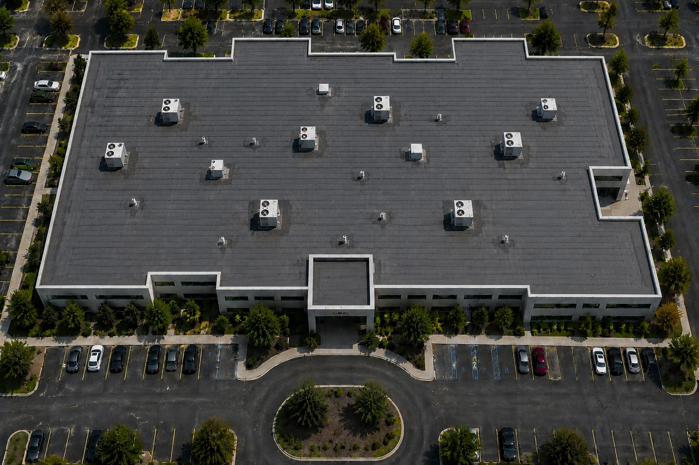
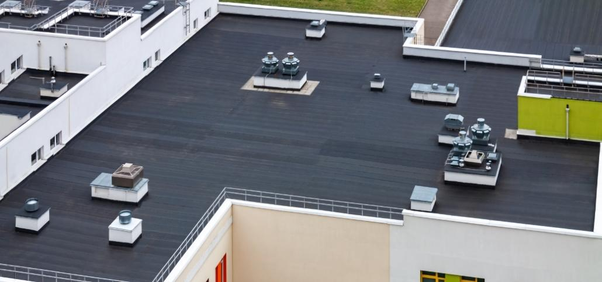
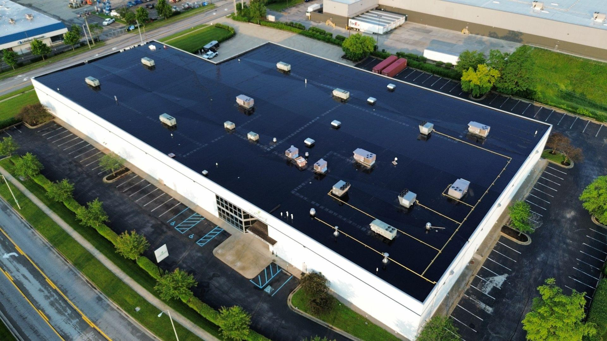
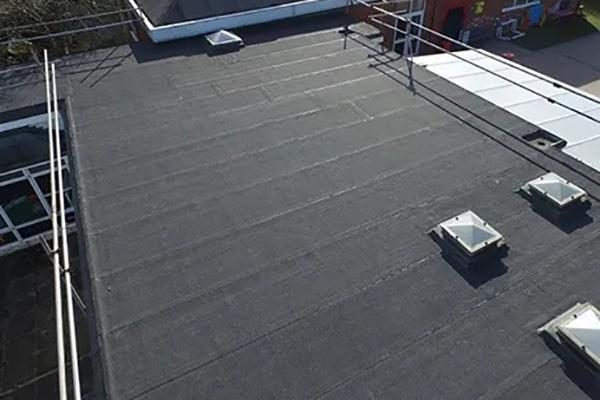

# Modified Bitumen Roof Identification

## Purpose

Use this guide to identify modified bitumen roofing from aerial, drone, and inspection imagery. Modified bitumen is an asphalt-based reinforced sheet system generally installed in relatively narrow rolls on low-slope roofs. Treat it as a roof-zone classification because a building may contain modified bitumen alongside single-ply membranes, built-up roofing, coatings, metal, or other systems.

Image-only classification is an informed assessment. Dark color alone does not establish modified bitumen. Use roll width, lap frequency, surface texture, flashings, and patches together, and preserve broader alternatives when resolution is inadequate.

## Typical Characteristics

- Reinforced asphalt sheet modified with polymer, commonly SBS or APP
- Installed in repeated rolls, often producing a relatively close-spaced seam pattern
- Cap sheets may be mineral-granulated, smooth surfaced, coated, or foil faced
- Common colors include black, charcoal, gray, brown, and light mineral-surface colors
- May be torch applied, hot asphalt applied, cold adhesive applied, or self-adhered
- Asphaltic flashing and layered patches commonly occur at curbs, drains, penetrations, and parapets
- Usually used on low-slope roofs and smaller transition or canopy areas

Installation method and polymer chemistry usually cannot be determined from aerial imagery.

## Primary Visual Cues

### Roll and Seam Pattern

- Numerous straight, parallel laps at relatively narrow and consistent spacing
- Rectangular roll fields with perpendicular or staggered end laps
- More frequent seams than broad-sheet EPDM, TPO, or PVC systems
- Laps may appear thicker, darker, rougher, or more asphaltic than thermoplastic welds
- Patches often align with the roll geometry and visibly overlap the surface

### Surface Texture and Color

- Black, charcoal, or gray field with a matte asphaltic appearance
- Mineral-surfaced cap sheets may show fine, consistent granule texture
- Adjacent rolls may vary slightly in shade due to age, granule loss, application, or repairs
- Smooth-surfaced material may appear dark and uniform, especially when recently installed
- Reflective coatings can turn the system silver or white while leaving roll laps visible beneath
- Tan, beige, or light-brown weathered fields may occur where mineral surfacing, oxidation, dirt, repairs, or aging alter the original appearance

### Edges, Flashings, and Penetrations

- Layered asphaltic flashing at parapets, curbs, drains, and penetrations
- Reinforced corners and multiple overlapping pieces rather than molded thermoplastic details
- Dark base flashing may continue up vertical surfaces
- Mastic, bleed-out, or heavy patching may be visible in close imagery

## Strongest Evidence for Modified Bitumen

Confidence increases when one roof zone shows:

1. A dark or mineral-surfaced low-slope field
2. Closely spaced parallel roll laps with repeated, consistent width
3. Perpendicular or staggered end laps creating a recognizable roll layout
4. Asphaltic texture, granules, layered flashing, or visible bleed-out in close imagery
5. Repairs and patches that follow the same asphalt-sheet construction

## Common Look-Alikes

### EPDM

EPDM is often black or dark gray but commonly uses much broader sheets and fewer field seams. Its surface looks smoother and more rubber-like, with tape or adhesive seams and rubber flashing details. At aerial resolution, use the controlled type `epdm_or_mod_bit`, displayed as **EPDM or Modified Bitumen**, if seam frequency and texture are not resolved. Do not guess between the two.

### Built-Up Roofing or Tar-and-Gravel

Gravel-surfaced BUR usually lacks an exposed regular roll-lap grid because aggregate covers the plies. Smooth BUR may look asphaltic and patch-heavy but may not show the consistent factory-roll pattern of modified bitumen. Exact distinction can require close texture or records.

### TPO or PVC

Thermoplastic membranes use broader sheets with narrow heat-welded laps and smoother matching flashings. Gray thermoplastics can resemble smooth modified bitumen, but their seams normally appear cleaner and less asphaltic.

### Coated Roof

A coating can mask color and texture while leaving original roll laps visible. Roller or spray variation, reinforced bands, and one finish spanning dissimilar repairs favor a coated existing roof. When supported, report both layers in observations. When a weathered asphaltic-looking roof cannot be separated between modified bitumen and coating, use `mod_bit_or_coating`, displayed as **Modified Bitumen or Coated Roof**, rather than guessing.

Roll laps may fall below the resolution of an overhead aerial image. Do not exclude modified bitumen solely because seams are not visible. A tan, matte, weathered field with wear or patching and asphaltic surface character can still support modified bitumen, especially when it forms the dominant roof and is clearly distinct from an adjacent smooth white TPO section. Reduce confidence and record the unresolved seams as a limitation.

### Rolled Roofing

Other asphalt roll products can share narrow laps and mineral surfacing. Do not force a specific modified-bitumen chemistry when only generic asphalt roll construction is visible; use `asphaltic roll roofing, likely modified bitumen`.

### Asphalt Shingles

Shingles occur on steeper slopes and form short, staggered tabs or courses rather than long continuous low-slope rolls. Very low-resolution imagery can hide this distinction, so use roof pitch and edge patterns.

## Mixed-Roof Buildings

1. Divide the roof into zones using parapets, expansion joints, elevation changes, additions, and changes in roll direction or surface texture.
2. Evaluate seam frequency, roll layout, texture, flashings, and repairs separately in each zone.
3. Assign a separate material label, confidence, and estimated visible-area share to every zone.
4. Preserve generic labels such as `dark asphaltic roof` where imagery cannot separate modified bitumen from BUR or coating.
5. Treat canopies, penthouses, and transition roofs independently from the main roof.

Example result:

```text
Roof zone A — mineral-surfaced modified bitumen, 70%, medium confidence
Roof zone B — white single-ply membrane, 25%, medium confidence
Roof zone C — metal canopy, 5%, high confidence
Overall building — mixed roof types
```

## Confidence Rules

### High Confidence

- Close imagery clearly shows narrow reinforced asphalt rolls, laps, end joints, and mineral or asphaltic texture
- Flashings and patches use consistent modified-bitumen construction
- Multiple independent cues agree within the roof zone

### Medium Confidence

- A regular narrow-roll pattern is visible on a dark or granular low-slope roof
- Modified bitumen is the leading classification, but smooth BUR, EPDM, or coating remains plausible
- Zone boundaries are clear but close material detail is limited

### Low Confidence

- Classification depends mainly on a dark roof color
- Roll width, seams, and texture are unresolved
- Moisture, shadow, glare, dirt, repairs, or compression obscure construction
- Multiple dark low-slope systems remain plausible

### Insufficient Evidence

Use `dark low-slope roof; material indeterminate` when the material family cannot be established. Request closer oblique imagery, lap and edge details, specifications, invoices, permits, or an on-site inspection.

## Reference Images

### Modified Bitumen Reference 1



Visible cues include a charcoal low-slope field with many close, parallel roll lines and perpendicular end joints across the building. The repeated narrow rectangular layout is more diagnostic than the dark color.

### Modified Bitumen Reference 2



Visible cues include a dark matte field with subtle but frequent parallel roll bands, broad uninterrupted low-slope areas, and asphaltic-looking detailing at equipment and perimeter transitions.

### Modified Bitumen Reference 3



Visible cues include a very dark, visually continuous roof with repeated lap bands and transverse joint patterns. Surface wetness or strong reflectance can hide texture, so roll geometry carries more weight than tone.

### Modified Bitumen Reference 4



Visible cues include a closer gray-black granular field, numerous narrow parallel laps, visible end joints, and layered material around roof openings. This view demonstrates the frequent seam pattern typical of roll-applied asphalt roofing.

## Recommended AI Output

Return the building classification; separate roof zones; material label and confidence; estimated area share; supporting roll, seam, texture, and flashing cues; plausible alternatives; image limitations; and verification needed. Never infer SBS versus APP, installation method, ply count, condition, moisture content, or warranty from aerial appearance alone.
