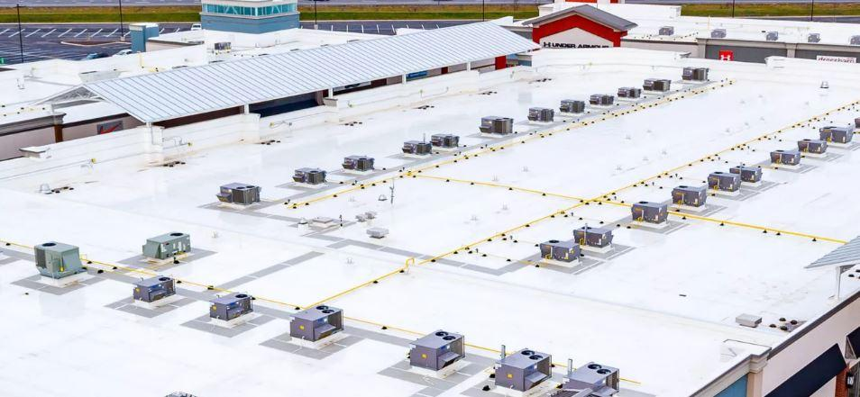
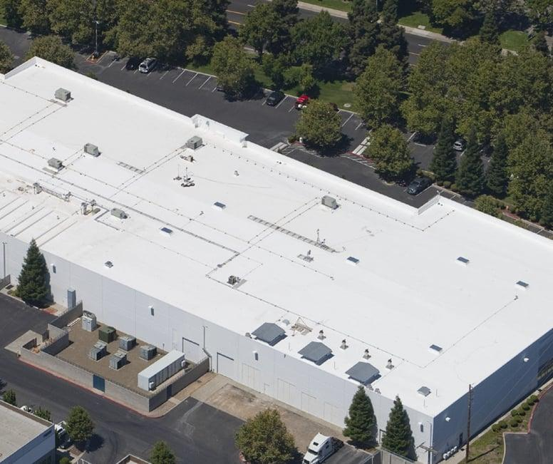
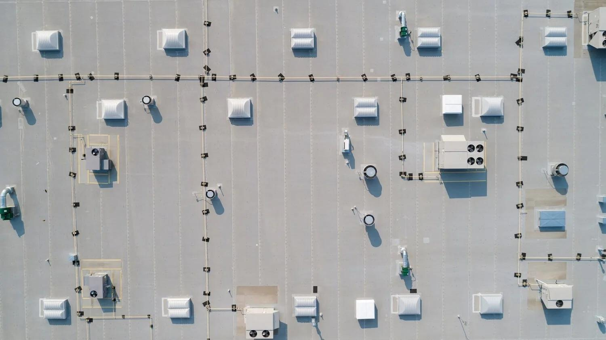
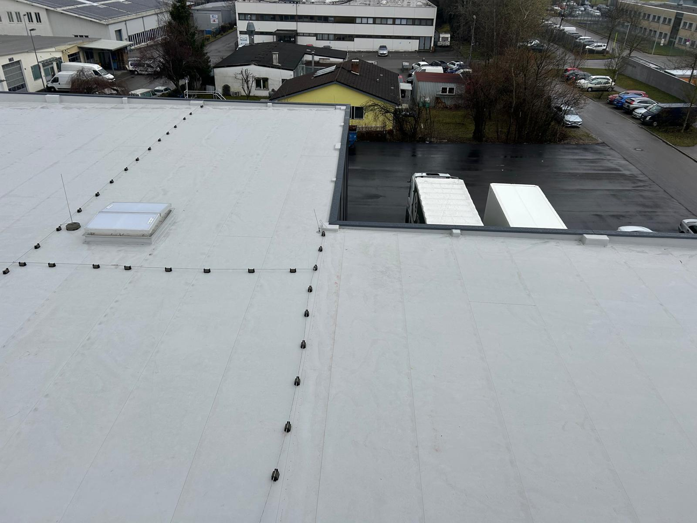

# PVC Roof Identification

## Purpose

Use this guide to identify polyvinyl chloride (PVC) roofing from aerial, drone, and inspection imagery. Treat PVC as a roof-zone classification rather than automatically assigning one material to an entire building. Buildings may contain PVC alongside TPO, EPDM, coatings, modified bitumen, metal, or other systems.

Image-only classification is an informed visual assessment. White PVC, white TPO, and coated roofs can be visually indistinguishable, especially from aerial imagery. In Stage 1, `pvc` may be ranked as an internal candidate when PVC-specific evidence exists. The final standard aerial report must return `tpo` when TPO remains equally plausible or `pvc_or_coating` when PVC/coating is favored over TPO but those two cannot be separated. Do not expose standalone PVC or coating as the final aerial result.

## Typical Characteristics

- Single-ply thermoplastic membrane used primarily on low-slope and flat roofs
- Commonly bright white, but also available in gray, tan, and other colors
- Smooth, uniform surface that may appear somewhat glossier or more reflective than weathered TPO
- Factory-made sheets joined by heat-welded lap seams
- Matching membrane commonly flashes parapets, curbs, penetrations, and changes in plane
- May be fully adhered, mechanically attached, or induction-welded
- Repairs and accessories often appear as clean geometric patches made from compatible membrane

Color and brightness are supporting evidence only. Camera exposure, moisture, dirt, age, product formulation, and coatings can change the apparent color and gloss.

## Primary Visual Cues

### Membrane Surface

- Bright-white or light-colored continuous roof field
- Smooth, sheet-like surface without exposed aggregate, granules, ribs, or corrugations
- Relatively even color and reflectance across a roof zone
- Dirt and drainage paths may be visible but can be less pronounced than on some TPO roofs
- Aged PVC often remains visually uniform, although discoloration and weathering still occur

### Seam Pattern

- Long, straight lap seams forming broad parallel membrane sheets
- Narrow, low-profile heat-welded seam lines
- Perpendicular end laps or detail seams where sheets and flashings intersect
- Mechanically attached systems may show repeated attachment patterns along sheet laps
- Fully adhered systems may appear nearly seamless from a high aerial view

### Edges, Curbs, and Penetrations

- Matching smooth membrane turned up parapets and equipment curbs
- Crisp thermoplastic corners and geometric flashing patches
- Prefabricated or field-fabricated boots and target patches around penetrations
- Metal coping at parapet tops with matching light membrane below
- Consistent welded construction at changes in plane when close detail is available

## Strongest Evidence for PVC

Confidence increases when the same roof zone shows:

1. A smooth, bright-white thermoplastic-looking field
2. Broad sheets joined by narrow welded lap seams
3. Matching welded flashings and patches
4. Relatively uniform, smooth, or glossy surface character
5. Labels, project records, manufacturer markings, or close construction details supporting PVC

The first four cues may establish a white thermoplastic membrane without proving PVC rather than TPO. Exact chemistry usually requires documentation or close material evidence.

## Common Look-Alikes

### TPO

TPO and PVC share their most important visible construction features. The following tendencies may help rank candidates but must not be treated as deterministic rules:

| Feature | PVC tendency | TPO tendency |
| --- | --- | --- |
| Overall color | Bright white | White to cream |
| Reflectivity | Higher | Medium |
| Surface texture | Smooth or glossier | Slightly matte |
| Dirt retention | Less noticeable | More noticeable |
| Aging | Often remains more uniform | Can become chalky |
| Seams | Sometimes less apparent | Often easier to see |

Product formulation, age, cleaning, moisture, dirt, sun angle, camera processing, attachment method, and resolution can reverse these tendencies. If TPO remains equally plausible, return `tpo` with reduced confidence. If the image favors PVC or coating over TPO but cannot distinguish those two, return `pvc_or_coating`, displayed as **PVC or Coated Roof**.

### Reflective Roof Coating

Coatings may preserve old seams, patches, fastener rows, cracks, or substrate texture beneath one continuous white finish. Roller marks, spray overlap, changing gloss, irregular reinforced bands, wear-through, and different underlying materials painted the same color may favor a coating. A new or weathered coating can still be indistinguishable from PVC in aerial imagery, so the standard aerial result is **PVC or Coated Roof**, not either material alone.

### White or Coated EPDM

White-faced or coated EPDM may resemble PVC. Tape or adhesive seams, rubber-like wrinkles, layered flashing, and black material visible at damage or transitions favor EPDM, but these generally require close imagery.

### Coated Spray Polyurethane Foam

Coated foam tends to look monolithic and subtly uneven or orange-peel textured. It usually lacks a repeated factory-sheet lap pattern and may form rounded transitions around penetrations.

### Coated Modified Bitumen or Built-Up Roofing

These systems may show narrower roll widths, heavier asphaltic laps, granules, alligatoring, bleed-through, or irregular reinforced flashing beneath a reflective coating.

### Metal Roofing

Metal panels have rigid geometry, repeated raised ribs, and directional sheen. PVC laps are low profile, and the flexible membrane conforms to the substrate.

## Mixed-Roof Buildings

1. Divide the roof into zones using parapets, expansion joints, elevation changes, additions, and changes in color or seam geometry.
2. Evaluate the surface, seams, flashings, and edges within each zone independently.
3. Assign each zone its own material label, estimated visible-area share, and confidence.
4. Preserve TPO as the conservative result when TPO remains equally plausible; otherwise use **PVC or Coated Roof** when those two cannot be separated.
5. Record transitions and areas obscured by equipment, shadow, water, vegetation, or poor resolution.

Example result:

```text
Roof zone A — PVC or Coated Roof, medium confidence; TPO considered less likely
Roof zone B — standing-seam metal, 30%, high confidence
Overall building — mixed roof types; no single whole-building classification
```

## Confidence Rules

### Strong PVC Candidate Evidence

- Close imagery shows a thermoplastic sheet, welded seams, and PVC-consistent details
- Documentation or readable markings identify PVC, while the standard aerial report still retains the combined PVC-or-coating label until separately verified
- Multiple independent cues agree and major look-alikes have been excluded

### Medium Confidence

- The roof is clearly a white thermoplastic single-ply membrane
- Smoothness, brightness, and uniformity favor PVC, but TPO remains plausible
- Roof-zone boundaries are clear, but material detail is limited

### Low Confidence

- Classification depends mainly on white color or reflectivity
- Seams and flashings are not resolved
- Glare, overexposure, dirt, moisture, snow, shadow, or compression affects the image
- TPO, coating, or white EPDM cannot be excluded

### Insufficient Evidence

Use `unknown/indeterminate roof type` when the imagery does not reliably establish a material family. Request close oblique imagery, detail photographs, edge exposure, specifications, invoices, permits, or an on-site inspection.

## Reference Images

The following repository images are positive PVC references. Use them to learn recurring patterns, but do not assume that a visually similar white roof is proven PVC rather than TPO.

### PVC Reference 1



Visible cues include a large bright-white commercial roof, broad smooth membrane fields, matching perimeter and curb flashing, and geometric patches around numerous rooftop units. The image strongly supports a white thermoplastic membrane but does not independently prove PVC chemistry.

### PVC Reference 2



Visible cues include a highly reflective, visually uniform white field across a large warehouse and light-colored flashing at the perimeter and penetrations. Seams are subtle at this distance, illustrating why seam absence is not proof against PVC.

### PVC Reference 3



Visible cues include a light-gray smooth field with repeated long parallel sheet seams and consistent low-profile laps around a dense equipment layout. This example shows that PVC need not appear bright white.

### PVC Reference 4



Visible cues include close, broad membrane sheets, straight parallel lap seams, and matching light flashing at the perimeter and roof opening. Local dirt and seam visibility demonstrate that real PVC surfaces are not always uniformly glossy or spotless.

## Recommended AI Output

Return the building classification; separate roof zones; material label and confidence for each zone; estimated area share; supporting cues; plausible alternatives; image limitations; and verification needed. Never infer condition, remaining service life, chemical resistance, or warranty status from the roof-type label alone.
