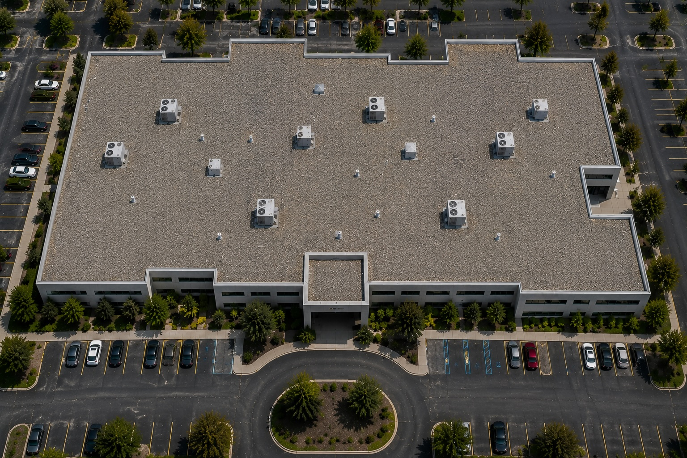
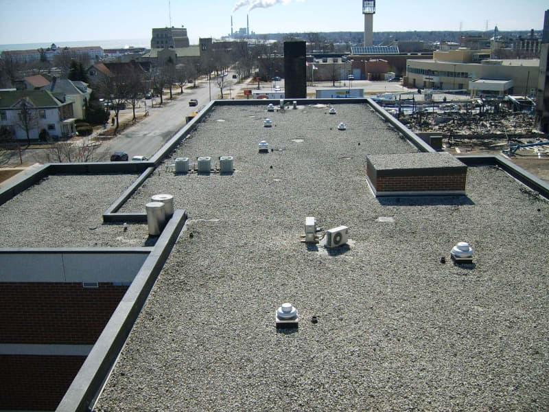
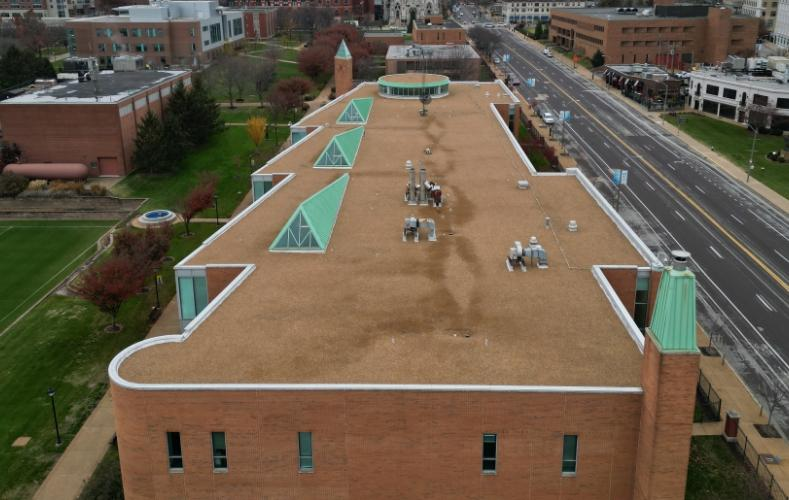
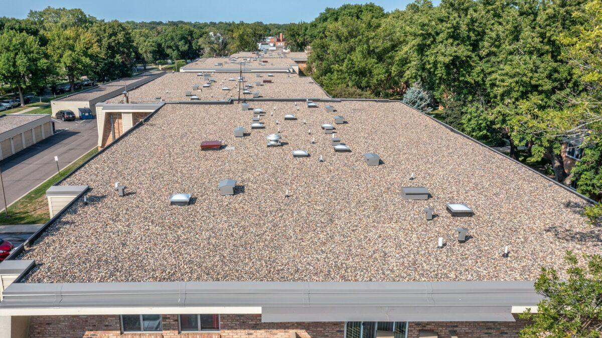
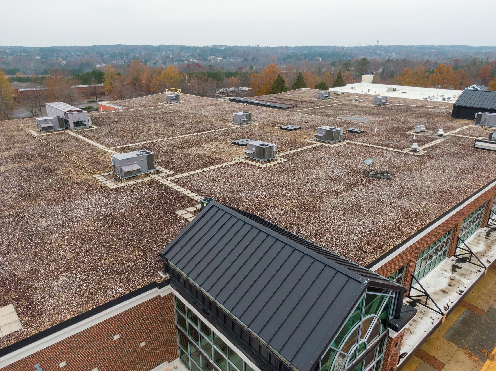

# Tar-and-Gravel Roof Identification

## Purpose

Use this guide to identify aggregate-surfaced built-up roofing (BUR), commonly called tar-and-gravel roofing, from aerial, drone, and inspection imagery. The visible surface is typically gravel embedded in or bonded to an asphaltic flood coat over multiple roof plies.

The common name `tar-and-gravel` does not prove that coal tar rather than asphalt was used. Treat the classification as a roof-zone assessment, and use `aggregate-surfaced low-slope roof` when imagery cannot distinguish built-up roofing from a loose-ballasted membrane assembly.

## Typical Characteristics

- Multi-ply asphaltic or bituminous low-slope roof assembly
- Continuous layer of small gravel or mineral aggregate across the roof field
- Aggregate commonly appears embedded, relatively flat, and uniformly distributed
- Field sheet seams are usually hidden by aggregate
- Smooth asphaltic membrane or flashing may be visible at parapets, curbs, drains, and bare areas
- Pavers may form service walkways through the aggregate
- Repairs may appear as dark asphaltic patches, new gravel areas, or coated sections

## Primary Visual Cues

### Aggregate Surface

- Fine, dense, continuous gravel texture across a bounded low-slope roof
- Mottled gray, tan, brown, white, or mixed coloration from individual aggregate pieces
- Relatively uniform stone size and depth across the field
- Flatter, more bonded-looking surface than loose rounded ballast when close imagery permits comparison
- No exposed regular sheet-lap grid across well-covered areas

### Perimeter and Transition Details

- Aggregate normally continues close to parapets and roof edges without a deliberate band of much larger perimeter stones
- Smooth asphaltic or membrane flashing may be visible vertically at walls and curbs
- Metal coping may cap parapets
- Material transitions, bare asphalt, or repair bands may appear near drains and equipment

### Equipment, Walkways, and Drainage

- Rooftop units, vents, and curbs interrupt the continuous gravel field
- Square concrete pavers may form narrow service routes between equipment areas
- Drains and scuppers may be surrounded by reduced gravel or dark asphaltic sumps
- Dark aggregate can result from moisture, sediment, asphalt exposure, or shadow

## Strongest Evidence for Tar-and-Gravel/BUR

Confidence increases when the same roof zone shows:

1. Fine, dense aggregate uniformly covering a low-slope field
2. Aggregate that appears embedded or bonded rather than freely piled
3. No deliberate larger-stone perimeter band or deep ballast drift pattern
4. Asphaltic flashing, flood coat, or dark substrate visible at transitions
5. Paver walkways and equipment details consistent with an aggregate-surfaced built-up roof

## Common Look-Alikes

### Loose-Ballasted Membrane Roof

This is the most important look-alike. Ballasted roofs often use larger, loose, rounded stones with visible depth, migration, and local piles. They may use larger or denser stones at perimeters and corners. BUR gravel tends to be smaller, flatter, more embedded, and more uniform. These tendencies are not always visible or consistently applied.

If the image does not resolve stone size, embedment, perimeter treatment, or exposed substrate, report `aggregate-surfaced low-slope roof (BUR vs ballasted membrane indeterminate)`.

### Modified Bitumen

Exposed modified bitumen typically shows narrow parallel rolls, lap seams, end joints, and a fine mineral cap-sheet texture rather than individually resolved field gravel. Heavy granulation or low resolution can blur this distinction.

### Protected Membrane or Inverted Roof

Protected assemblies place insulation and ballast or pavers above waterproofing and can resemble other ballasted roofs. Aerial imagery cannot establish the layer order. Use a visible-surface classification unless records are available.

### Decorative Gravel or Rooftop Landscaping

Decorative aggregate may occupy isolated amenity, drainage, or planting zones rather than the entire weathering roof. Look for borders, planters, occupied terraces, and changes in elevation.

### Coated or Deteriorated Asphalt Roofing

Rough coating, alligatoring, patching, and image noise may resemble fine gravel. Confirm individually resolved aggregate and consistent roof-wide distribution.

## BUR Versus Ballasted Membrane Comparison

| Feature | Tar-and-gravel/BUR tendency | Ballasted membrane tendency |
| --- | --- | --- |
| Aggregate size | Smaller, finer gravel | Often larger loose stone |
| Placement | Embedded or bonded in asphalt | Loose-laid over the assembly |
| Field appearance | Flatter and relatively uniform | More three-dimensional and variable |
| Perimeter | Often similar aggregate to field | May have larger or deeper perimeter ballast |
| Exposed substrate | Dark asphaltic flood coat or flashing | Single-ply membrane may appear beneath displaced stone |
| Sheet seams | Normally concealed | Membrane seams may appear where ballast is displaced |

Use the table only as supporting evidence. From typical aerial imagery, the exact assembly may remain indeterminate.

## Mixed-Roof Buildings

1. Divide the roof into zones using parapets, expansion joints, elevation changes, additions, paver boundaries, and changes in aggregate or membrane surface.
2. Evaluate aggregate size, distribution, perimeter treatment, exposed substrate, flashings, and drainage within each zone.
3. Assign a separate material label, estimated visible-area share, and confidence to every zone.
4. Keep metal canopies, membrane additions, coated patches, and paver-covered areas separate.
5. Do not infer the hidden assembly beneath aggregate without visible evidence or records.

Example result:

```text
Roof zone A — aggregate-surfaced low-slope roof, likely BUR, 75%, medium confidence
Roof zone B — standing-seam metal, 15%, high confidence
Roof zone C — white single-ply membrane, 10%, medium confidence
Overall building — mixed roof types
```

## Confidence Rules

### High Confidence

- Close imagery shows fine aggregate embedded in an asphaltic surface
- Asphaltic flashing or flood coat is visible at transitions
- Loose ballast and other aggregate-covered assemblies have been excluded
- Multiple independent cues agree within the roof zone

### Medium Confidence

- Fine, uniform aggregate clearly covers a low-slope roof
- BUR is favored by field and perimeter patterns, but a ballasted membrane cannot be fully excluded
- Zone boundaries are clear while embedment detail remains limited

### Low Confidence

- Only a mottled aggregate-like surface is visible
- Stone size, depth, embedment, and exposed substrate are unresolved
- Shadow, moisture, vegetation, snow, or compression obscures the field
- The area could be BUR, loose ballast, landscaping, or a protected membrane assembly

### Insufficient Evidence

Use `aggregate-surfaced low-slope roof; assembly indeterminate` when aggregate is established but the assembly is not. Use `unknown roof type` when even the surface cannot be confirmed. Request close oblique images, displaced-stone details, edges, drain areas, specifications, or an on-site inspection.

## Reference Images

### Tar-and-Gravel Reference 1



Visible cues include a building-wide field of fine, light-gray aggregate with relatively uniform size and coverage. Rooftop equipment interrupts the texture, while no exposed roll-seam pattern is visible.

### Tar-and-Gravel Reference 2



Visible cues include a dense gray gravel field across several low-slope roof levels, consistent aggregate carried near parapets, and equipment rising through the continuous surface.

### Tar-and-Gravel Reference 3



Visible cues include a tan, fine-textured aggregate field with uniform coverage across a complex building outline. The color differs from the gray examples, demonstrating that aggregate color alone is not diagnostic.

### Tar-and-Gravel Reference 4



Visible cues include individually resolved mixed-color gravel, consistent roof-wide coverage, and no obvious factory-sheet lap grid. The oblique angle helps establish the three-dimensional aggregate surface.

### Tar-and-Gravel Reference 5



Visible cues include extensive mixed brown and light aggregate, paver service paths connecting rooftop equipment, and multiple bounded roof zones. Ponded areas and changing aggregate tone should be treated as condition cues rather than automatically as different materials.

## Recommended AI Output

Return the building classification; separate roof zones; visible surface and likely assembly as separate fields; estimated area share; confidence; supporting aggregate, perimeter, flashing, and substrate cues; plausible alternatives; limitations; and verification needed. Never infer ply count, bitumen chemistry, membrane condition beneath aggregate, moisture content, structural loading, or warranty from aerial appearance alone.
