# TPO Roof Damage Identification

## Description

This file provides a starting reference for identifying and documenting visible damage on thermoplastic polyolefin (TPO) roof surfaces. It is intended to help distinguish potential membrane damage from normal roof features, temporary conditions, staining, shadows, and image artifacts. Damage observations may include punctures, tears, open seams, wrinkles, displaced flashing, surface deterioration, impact marks, and other conditions that could affect roof performance.

## Why It's Important

Accurate damage identification helps prioritize inspection and maintenance before a localized defect develops into a leak or a larger roofing-system failure. TPO membranes provide waterproofing through the membrane, seams, flashings, and penetrations, so damage in any of these areas may allow moisture into the insulation or roof assembly. Consistent documentation also supports condition scoring, repair planning, budgeting, and comparison of roof conditions over time.

## Visual Characteristics

### Aging

- Fading, chalking, discoloration, surface erosion, or loss of the membrane's original finish
- Fine cracking, crazing, brittleness, abrasion, and exposed reinforcement
- Deteriorated welds, sealants, patches, flashings, and termination details
- Concentrated wear along walk paths, around service areas, and near rooftop equipment

### Ponding

- Standing water around drains, equipment, curbs, seams, and visibly depressed areas
- Dark staining, sediment rings, algae, biological growth, and dirt accumulation
- Blocked drains or scuppers and water retained after surrounding areas have dried
- Membrane discoloration, wrinkling, or accelerated surface deterioration within ponding zones

### Leaking

- Punctures, holes, open seams, failed welds, and lifted patch edges
- Loose, damaged, or separated flashing around penetrations, walls, curbs, and roof edges
- Staining, repeated repairs, or deterioration concentrated around a suspected entry point
- Soft, sunken, swollen, or irregular areas that may indicate wet insulation beneath the membrane

### Hail Damage

- Circular bruises, dimples, fractures, cuts, or punctures in the membrane
- Concentrated impact patterns visible under low-angle lighting
- Cracked or displaced membrane where hail struck rigid substrate, fasteners, or insulation joints
- Dents and impact marks on adjacent flashings, vents, drains, and rooftop equipment

### Deformation

- Wrinkles, ridges, buckling, bubbling, blisters, or loose membrane areas
- Bridging or tenting at changes in plane, curbs, penetrations, and perimeter details
- Depressions or raised areas associated with insulation movement, compression, or trapped moisture
- Membrane displacement, shrinkage, or tension around seams, edges, and rooftop components

### Splitting

- Linear cracks, cuts, tears, or full-depth openings in the membrane
- Open, lifted, separated, or irregular heat-welded seams
- Stress splits at corners, drains, penetrations, insulation joints, and changes in plane
- Cracked patches, flashings, or repairs with separated edges or exposed reinforcement

## AI Confidence Factors

AI confidence should reflect image quality and the strength of the visual evidence.

### High Confidence

- The suspected damage is clearly visible at useful resolution
- Multiple visual indicators support the same damage classification
- The feature has distinct edges, depth, separation, or exposed material
- The location and surrounding roof context are visible
- The condition appears consistently in more than one image or viewing angle

### Medium Confidence

- The feature is visible but partially obscured, small, or near the image-resolution limit
- Lighting, glare, shadows, staining, or debris could affect interpretation
- The image shows a likely defect but not enough detail to confirm its full extent
- Only one image or viewing angle is available

### Low Confidence

- The suspected damage is blurry, distant, heavily shadowed, or obstructed
- The feature could reasonably be normal roof construction, dirt, water, glare, or an image artifact
- The membrane type or roof location cannot be confirmed
- The visible evidence is too limited to distinguish damage from cosmetic variation

Low- and medium-confidence findings should be verified through additional imagery or an on-site inspection.

## Severity

Severity should consider the apparent size, location, extent, active moisture risk, and potential effect on the roofing system.

### Minor

Localized cosmetic wear or a small defect with no clear membrane opening, seam separation, exposed substrate, or immediate leak indicator. Monitor the condition and verify during routine inspection.

### Moderate

A distinct defect, deteriorated repair, wrinkle, abrasion, or localized seam/flashing concern that may reduce service life or allow moisture entry if left uncorrected. Schedule a qualified roofing inspection and repair evaluation.

### Severe

An open seam, puncture, tear, exposed substrate, significant flashing failure, widespread deterioration, or other condition indicating a high likelihood of water intrusion or rapid progression. Prioritize prompt professional inspection and corrective action.

### Critical

Extensive membrane failure, active or strongly indicated water intrusion, large exposed areas, widespread seam failure, or damage affecting roof safety or immediate weather protection. Escalate for urgent professional assessment and temporary protection where appropriate.

## Example Images

### Aging

#### Aging Example 1

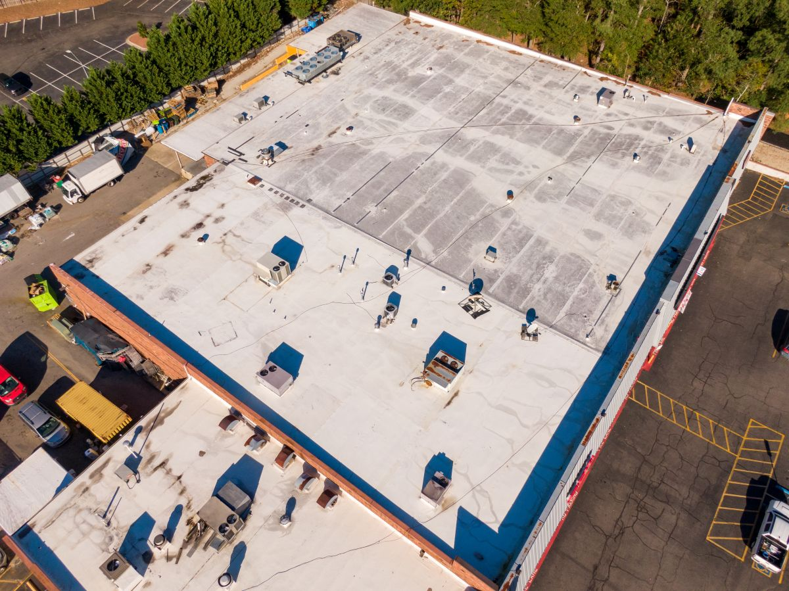

#### Aging Example 2

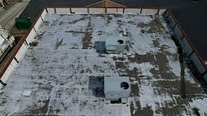

#### Aging Example 3

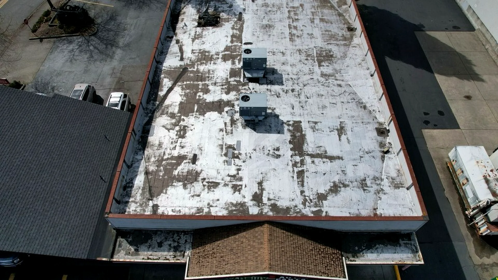

#### Aging Example 4

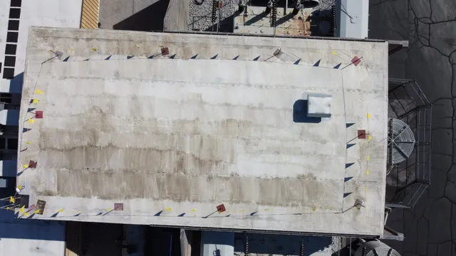

#### Aging Example 5

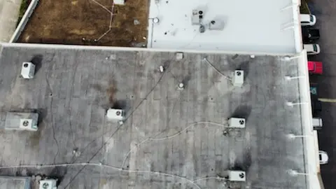

#### Aging Example 6

### Ponding

#### Ponding Example 1

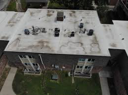

Shows chronic ponding surrounding rooftop HVAC.

Expected Condition Impact:

-15

Confidence:

95%

---

#### Ponding Example 2

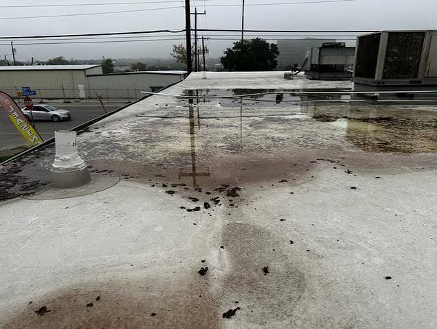

Large central ponding.

Drain appears blocked.

Expected Condition Impact:

-20

#### Ponding Example 3

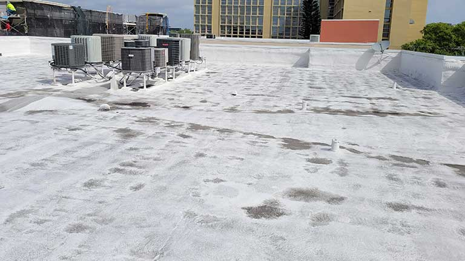

#### Ponding Example 4

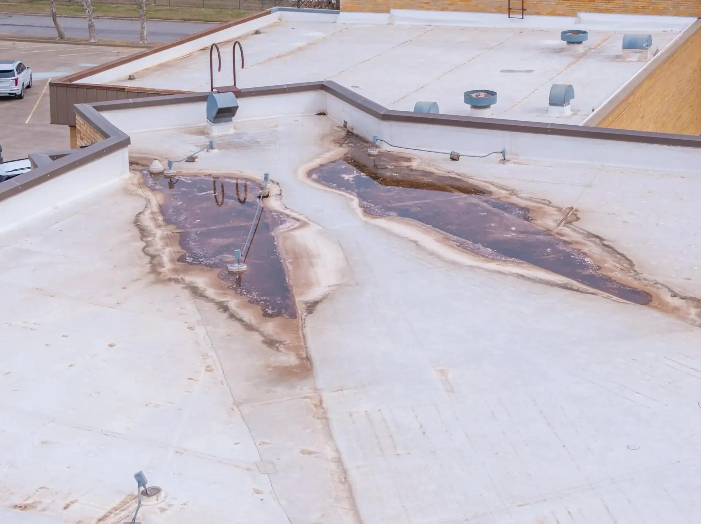

#### Ponding Example 5

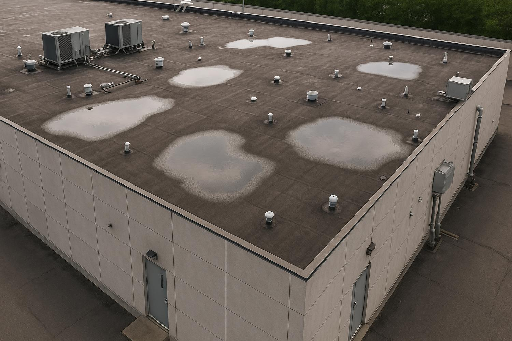

#### Ponding Example 6

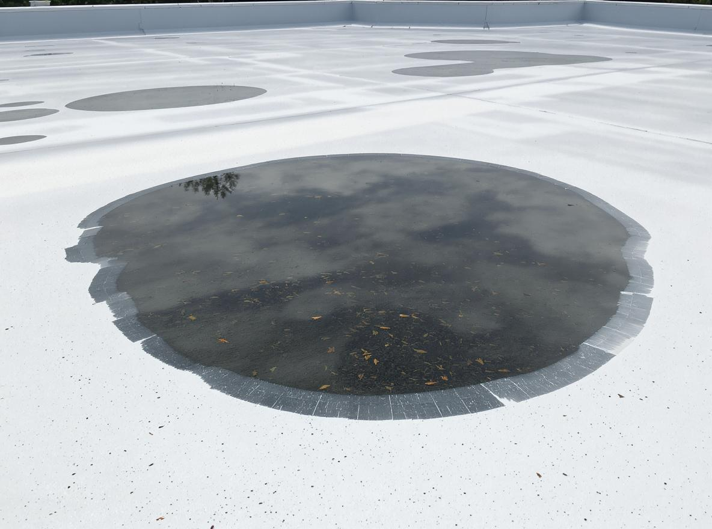

#### Ponding Example 7

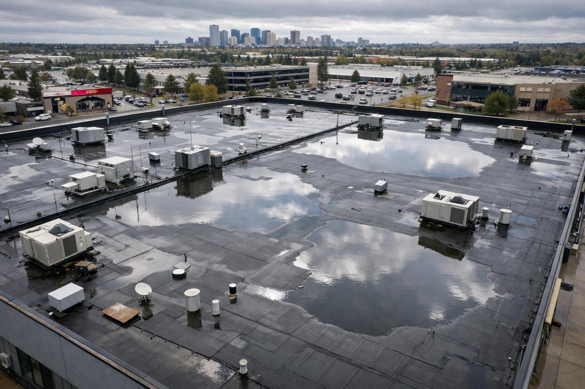

#### Ponding Example 8

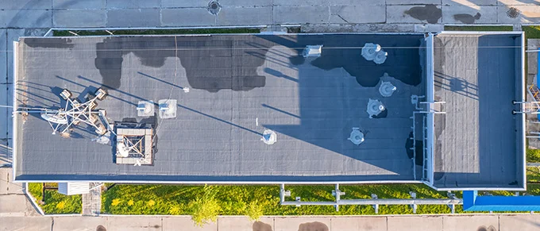

#### Ponding Example 9

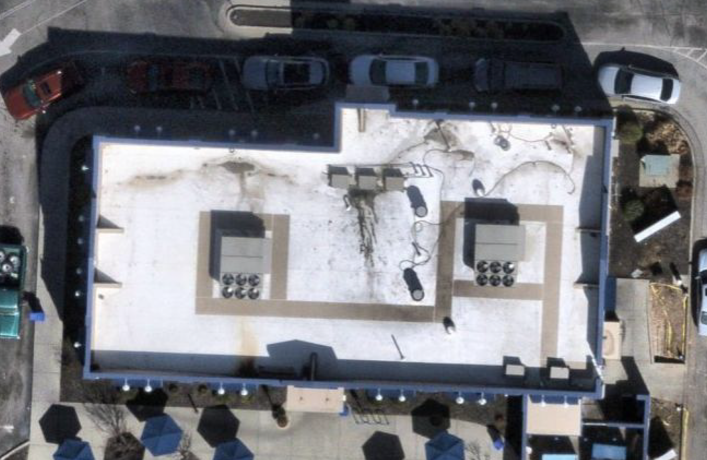

### Leaking

#### Leaking Example 1

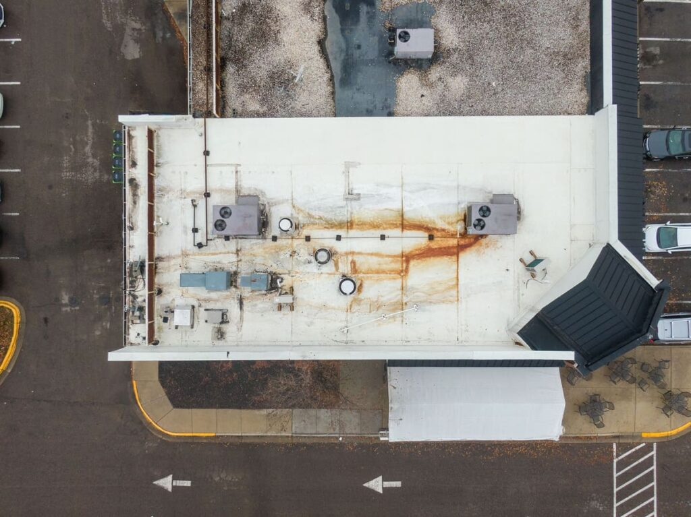

#### Leaking Example 2

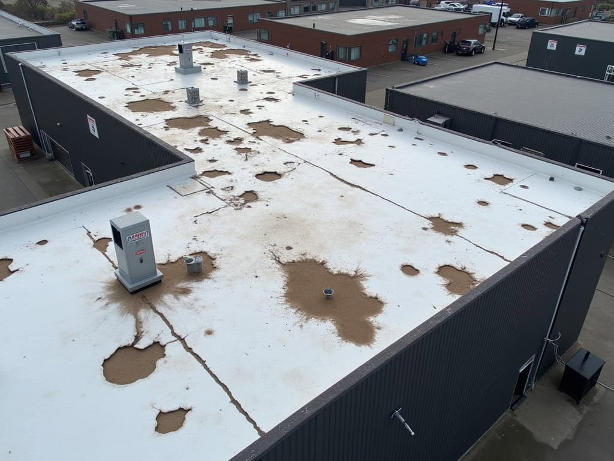

### Hail Damage

#### Hail Damage Example 1

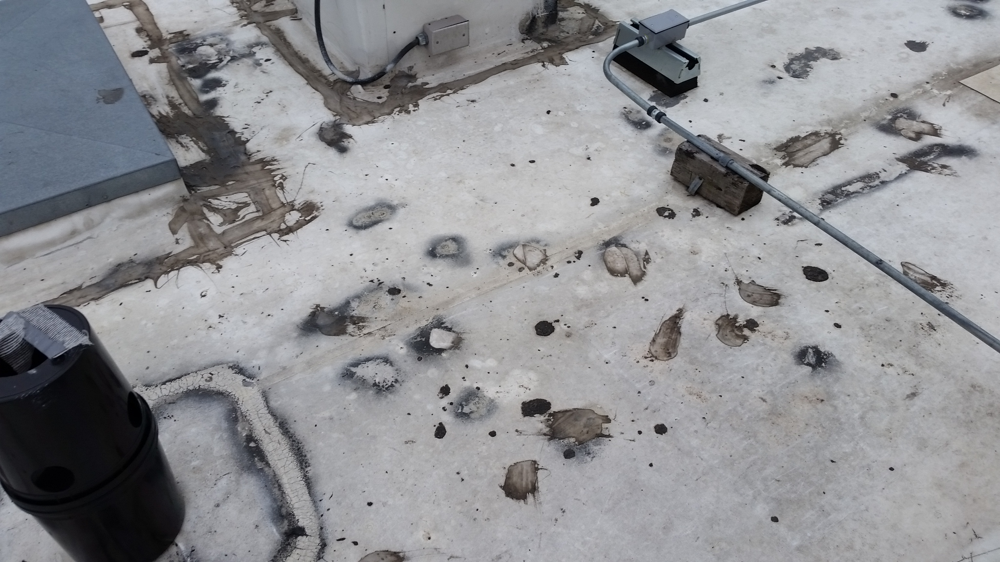

### Deformation

#### Wrinkle Example 1

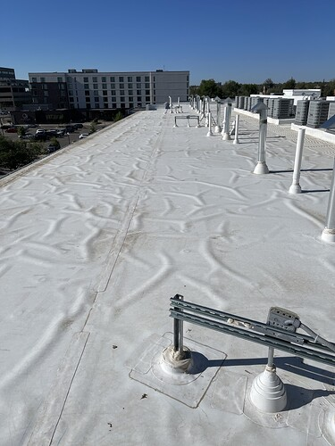

#### Wrinkle Example 2

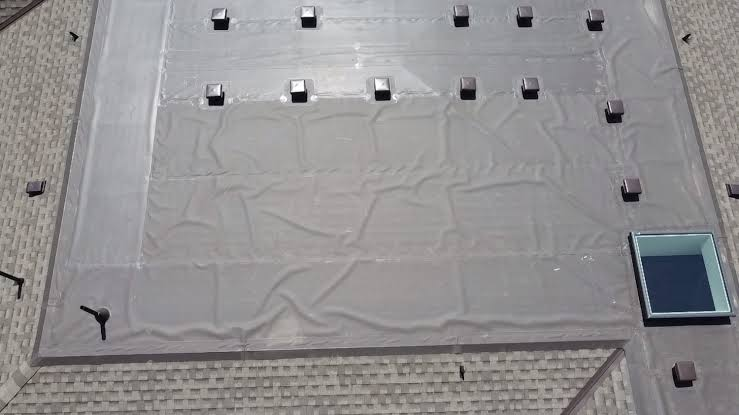

### Splitting

No TPO splitting example images have been added yet.
