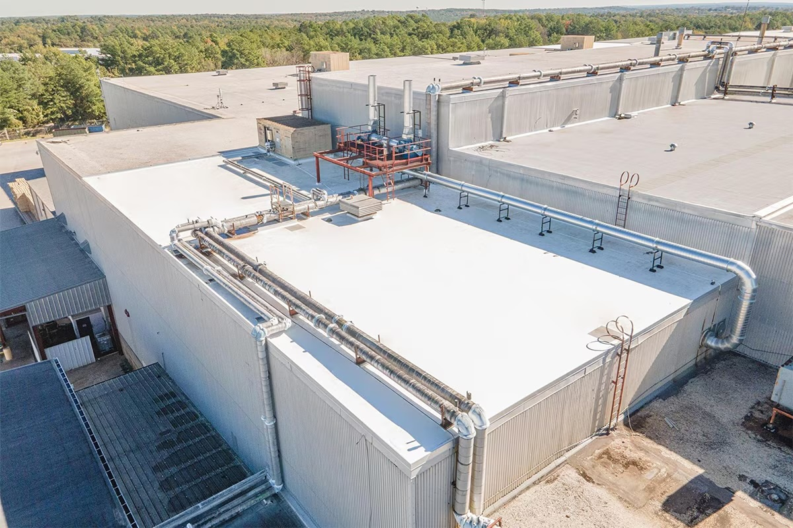
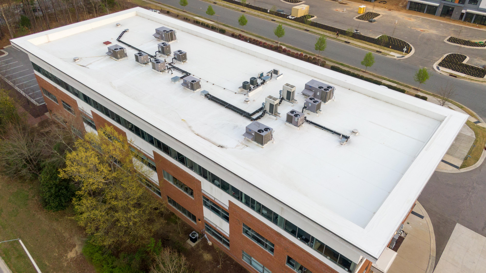
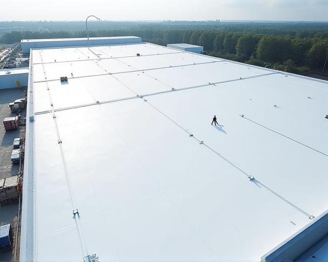
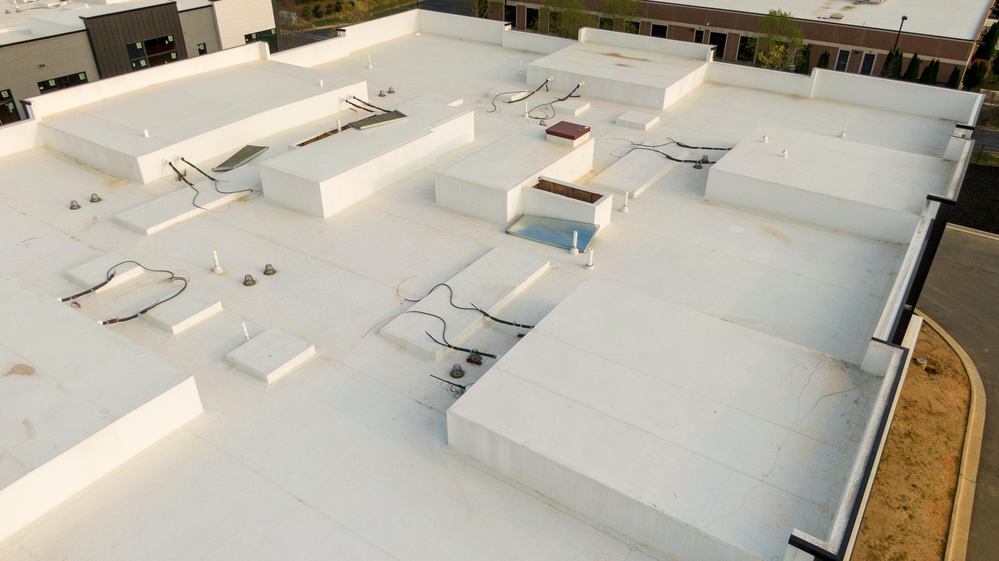
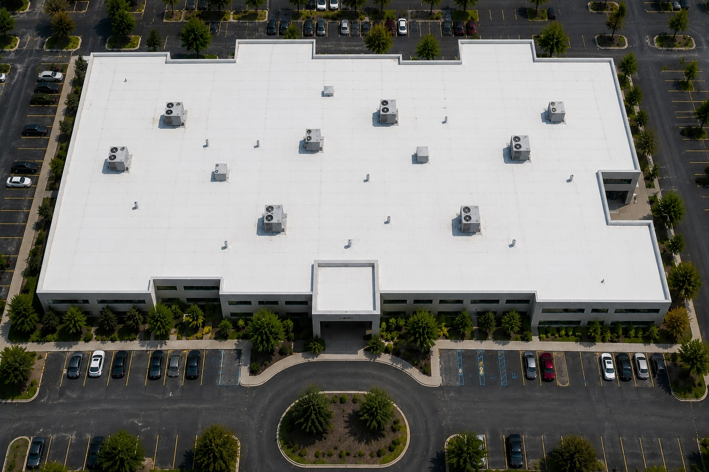

# TPO Roof Identification

## Purpose

Use this guide to identify thermoplastic polyolefin (TPO) roofing from aerial, drone, and inspection imagery. Treat TPO as a roof-zone classification, not automatically as the roof type for the entire building. A building may contain TPO alongside EPDM, PVC, modified bitumen, built-up roofing, metal, coatings, or other systems.

Image-only classification is an informed visual assessment. White TPO, white PVC, and some coated roofs can be visually indistinguishable, especially in aerial imagery. For this classification workflow, use `tpo` as the conservative default when the imagery supports a smooth white membrane-like roof but does not clearly establish PVC or coating. Reduce confidence and retain PVC and coating as alternatives rather than returning a combined type. Do not apply this default to patchy, heavily weathered, asphaltic-looking, or aggregate-textured surfaces.

## Typical Characteristics

- Single-ply thermoplastic membrane used primarily on low-slope and flat roofs
- Most commonly white or off-white; gray and tan products also exist
- Smooth, uniform, slightly reflective surface without exposed aggregate or granules
- Factory-made sheets joined with heat-welded lap seams
- Field membrane commonly continues up curbs and parapet walls as matching smooth flashing
- May be fully adhered, mechanically attached, or induction-welded; attachment method changes the visible pattern
- Repairs and accessories are often made from matching membrane and may appear as clean geometric patches

Color is supporting evidence only. A white roof may instead be PVC, white EPDM, a coated membrane, spray polyurethane foam, modified bitumen with a reflective coating, or another roof covered by a white restoration system.

## Primary Visual Cues

Look for multiple cues that agree with one another.

### Membrane Surface

- Bright white, off-white, light gray, or tan continuous field
- Smooth sheet-like appearance with little or no coarse texture
- Broad, even reflectance; dirt, oxidation, and drainage paths may reduce brightness
- No regular standing ribs, corrugations, shingles, exposed gravel, or mineral granules

### Seam Pattern

- Long, straight lap seams forming broad membrane sheets
- Seams usually run parallel across a roof zone, with perpendicular end laps or detail seams where needed
- Heat-welded seams tend to read as narrow, clean, low-profile lines rather than thick asphalt bands
- Mechanically attached systems may show regular linear patterns associated with concealed plates or fasteners near sheet laps
- Fully adhered systems may look almost seamless from a high aerial view; an absent visible seam pattern must not be treated as proof that the roof is not TPO

### Edges, Curbs, and Penetrations

- Smooth matching membrane turned up parapets, equipment curbs, and raised roof sections
- Crisp, heat-formed or separately flashed corners around curbs and penetrations
- White or matching-color base flashing at walls and transitions
- Prefabricated pipe boots, circular target patches, and geometric patches may be visible in close imagery
- Metal coping may cap the parapet even when the vertical flashing below it is TPO

### Roof Geometry and Context

- Common on broad commercial and industrial low-slope roofs
- Often installed as one continuous system across large rectangular fields
- Drainage staining may follow subtle slope lines toward internal drains or scuppers
- Roof additions, changes in elevation, expansion joints, and parapet separations can mark boundaries between different roofing systems

## Strongest Evidence for TPO

Confidence increases when the image shows several of the following together:

1. A smooth white or light-colored single-ply field
2. Broad parallel sheets with narrow straight lap seams
3. Matching smooth membrane flashings at curbs, walls, and penetrations
4. Clean thermoplastic-looking welded details or patches in close imagery
5. Consistent construction across one clearly bounded roof zone

Color by itself is weak evidence. From distant aerial imagery, even the full combination may establish only a white single-ply membrane, not TPO specifically.

## Common Look-Alikes

### PVC

PVC commonly has the same white, smooth, heat-welded, single-ply appearance as TPO. Do not distinguish TPO from PVC solely by color, seam direction, roof age, building use, or aerial appearance. Use labels, specifications, permits, invoices, manufacturer markings, or sufficiently close material details when an exact distinction is required.

#### Visual Comparison: TPO Versus PVC

The following are typical visual tendencies, not definitive identification rules:

| Feature | TPO tendency | PVC tendency |
| --- | --- | --- |
| Overall color | White to cream | Bright white |
| Reflectivity | Medium | Higher |
| Surface texture | Slightly matte | Smooth or glossier |
| Dirt retention | More noticeable | Less noticeable |
| Aging | Can become chalky | Often remains more uniform |
| Seams | Often easier to see | Sometimes less apparent |

Use these tendencies only as supporting evidence and consider them together. Product formulation, membrane age, cleaning, surface moisture, accumulated dirt, coatings, camera exposure, sun angle, and image processing can change every characteristic in the table. A weathered PVC roof may appear dull or dirty, while a newer TPO roof may appear bright and glossy. Both materials use heat-welded seams, and seam visibility also depends on attachment method, viewing angle, resolution, and lighting.

When close imagery is available, compare multiple roof areas under similar lighting. A slightly cream, matte, or visibly soiled field with clearly resolved welded seams may favor TPO; a consistently bright-white, smoother, more reflective field with less apparent seams may favor PVC or coating. These cues should normally produce only a tentative preference. If TPO remains equally plausible, return `tpo` with reduced confidence. If PVC/coating is favored over TPO but those two cannot be separated, return `pvc_or_coating`, displayed as **PVC or Coated Roof**.

### White or Coated EPDM

White-faced EPDM and coated black EPDM can resemble TPO. Possible supporting cues for EPDM include tape or adhesive lap seams, visible black membrane at damage or transitions, and rubber-like wrinkles, but these require close imagery. A coating may partially obscure the original seams and flashings.

### Reflective Roof Coating

A coating may follow the texture, seams, repairs, and irregularities of the roof beneath it. Look for roller or spray variation, coating wear, irregular reinforcement at seams, and evidence that multiple underlying materials were painted to a similar color.

#### Visual Comparison: TPO Versus a Coated Roof

Features favoring exposed TPO include:

- Repeated manufactured sheet widths with long, straight, consistently spaced lap seams
- Crisp, low-profile welded seams and geometric thermoplastic patches
- Matching sheet-membrane flashings with clearly constructed corners and penetration details
- Consistent surface character within each installed membrane sheet

Features favoring a coating over an existing roof include:

- Roller marks, spray overlap, mottled gloss, or uneven application thickness
- Original seams, repairs, fastener rows, cracks, fabric reinforcement, or substrate texture showing through the coating
- Coating that flows continuously across several types of old patches or flashing materials
- Irregular reinforced bands at seams, penetrations, drains, and transitions rather than consistent factory-sheet laps
- Worn, peeled, or thin areas exposing a darker or differently textured roof beneath
- One white finish spanning roof sections that retain different underlying seam patterns or surface textures

A coating can cover TPO as well as other roof systems, so `coated roof` and `TPO substrate` are not mutually exclusive. Newly applied coatings can look smooth and uniform enough to be indistinguishable from a white membrane in aerial imagery. If coating-specific application, wear, or substrate evidence is not clear, return `tpo` with reduced confidence and list coating as an alternative. Request close oblique images, exposed edge details, or installation records.

### Spray Polyurethane Foam

Coated spray foam often has a monolithic but subtly uneven or orange-peel surface. It usually lacks a repeated sheet-lap grid and may form rounded, built-up transitions around penetrations.

### Modified Bitumen or Built-Up Roofing

Coated asphalt roofs may be white but often show narrower roll widths, heavier lap lines, asphalt bleed-through, alligatoring, granules, or irregular reinforced flashing. These clues may disappear in low-resolution imagery.

### Metal Roofing

Metal panels have repeated raised ribs or standing seams, rigid panel geometry, and often a directional sheen. TPO seams are low-profile lap lines and the membrane conforms to the substrate.

## Mixed-Roof Buildings

Do not assign one roof type to the whole building until every visible roof zone has been evaluated.

1. Divide the roof into contiguous zones using parapets, expansion joints, elevation changes, additions, material transitions, and abrupt changes in color or seam geometry.
2. Evaluate the surface, seam pattern, flashings, and edges inside each zone independently.
3. Assign a separate roof-type label and confidence to each zone.
4. Estimate each zone's share of the visible roof area when practical.
5. Record transition boundaries and any zones hidden by equipment, shadow, water, vegetation, or image limits.
6. If TPO, PVC, and coating cannot be separated visually, use the canonical `tpo` type with reduced confidence and preserve the others as alternatives.

Example result:

```text
Roof zone A — TPO, 65%, medium confidence; PVC and coating remain alternatives
Roof zone B — dark single-ply membrane, likely EPDM, 25%, medium confidence
Roof zone C — metal, 10%, high confidence; subtype visible as standing seam
Overall building — mixed roof types; no single whole-building classification
```

## Confidence Rules

### High Confidence

- Close, sharp imagery shows a smooth thermoplastic sheet, welded lap seams, and matching welded details
- Several independent TPO-consistent cues are visible in the same roof zone
- Documentation or readable markings support the image classification
- Major look-alikes, especially PVC, have been excluded by non-color evidence

### Medium Confidence

- The roof is clearly a white or light single-ply membrane and has consistent seams and flashings
- TPO is the leading classification, but PVC, white EPDM, or a coated membrane cannot be fully excluded
- The roof zone and its boundaries are clear, but detail resolution is limited

### Low Confidence

- The decision depends mainly on roof color
- Seams and flashing details are not resolved
- Glare, overexposure, shadow, snow, standing water, dirt, or image compression obscures the surface
- Multiple plausible roof types remain

### Insufficient Evidence

Use `unknown/indeterminate roof type` when the roof is substantially obscured or the imagery does not support even a reliable material family. Request closer oblique imagery, detail photographs, project records, or an on-site inspection.

## Reference Images

The following repository images are positive TPO references. Use them to learn recurring patterns, but do not expect every TPO roof to share their color, scale, age, or attachment pattern.

### TPO Reference 1



Visible cues include a bright, smooth membrane across several low-slope roof levels and matching light-colored flashing at edges and raised sections. At this viewing distance, the image supports a light single-ply roof more strongly than it proves TPO instead of PVC.

### TPO Reference 2



Visible cues include a continuous white field, faint straight sheet lines, and white membrane carried up the perimeter and equipment curbs. Drainage discoloration demonstrates why brightness should not be expected to remain perfectly uniform.

### TPO Reference 3



Visible cues include a large reflective white field with long parallel seams and repeated linear attachment or lap patterns. The broad rectangular membrane layout is more useful than color alone.

### TPO Reference 4



Visible cues include smooth white field membrane, faint straight seams, and matching membrane flashings across numerous curbs and changes in elevation. Dirt, traffic, repairs, and drainage marks produce local color variation without necessarily indicating a different roof type.

### TPO Reference 5



Visible cues include a bright-white continuous field with a repeated broad rectangular seam grid, matching light perimeter construction, and consistent detailing around rooftop equipment and penetrations. This image strongly supports a white single-ply system, while exact separation of TPO from PVC still requires closer material evidence or records.

## Recommended AI Output

For every analyzed building, return:

- `building_classification`: single roof type, mixed roof types, or indeterminate
- `roof_zones`: zone identifier, location or polygon, material label, estimated area share, and confidence
- `supporting_cues`: the observed features that support each label
- `alternatives`: plausible look-alikes that remain
- `limitations`: resolution, angle, obstruction, glare, weather, or missing detail
- `verification_needed`: additional imagery or records required to confirm the exact membrane

Never infer roof condition, damage, remaining service life, or warranty status from the roof-type label alone.
